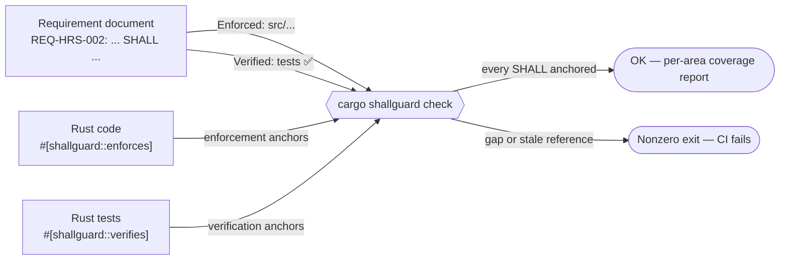
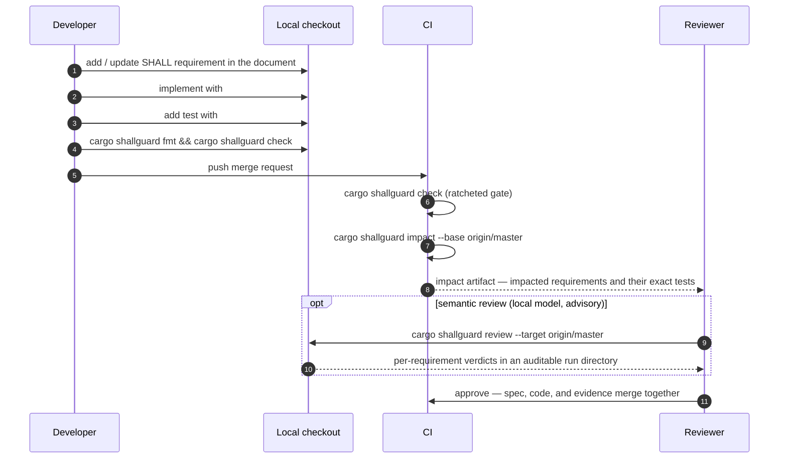

# ShallGuard

[](https://github.com/sigi64/shallguard/actions/workflows/rust.yml)
[](https://crates.io/crates/shallguard)
[](https://crates.io/crates/cargo-shallguard)
[](https://docs.rs/shallguard)
[](https://github.com/sigi64/shallguard/blob/master/Cargo.toml)
[](LICENSE)

ShallGuard is requirement-assurance tooling for Cargo projects. It keeps
numbered system requirements written in Markdown connected to the Rust code
that enforces them and the tests that verify them — and fails CI the moment
that connection breaks.

The workspace contains the reusable `shallguard` library, the
`cargo-shallguard` Cargo subcommand, and its internal procedural-macro crate.

The project is licensed under the [MIT License](LICENSE).

## Why "ShallGuard"?

Requirement specifications written in [RFC 2119](https://www.rfc-editor.org/rfc/rfc2119)
style use the normative keyword **SHALL** for mandatory behavior:

> **REQ-TRACE-004** — `#[shallguard::verifies]` **SHALL** count as automated
> evidence only on a syntactically recognized, non-ignored test function…

ShallGuard *guards the SHALL statements*: every SHALL must point at the code
that enforces it and the automated test that proves it, and the ratcheted
check makes sure a guarded SHALL can never silently lose its evidence again.

## How it works

Three ingredients, one deterministic check:

1. **Requirement documents** — Markdown files with numbered requirements
   (`REQ-<AREA>-<NNN>`), each citing its *Enforced:* source locations and
   *Verified:* tests.
2. **Anchors in code** — attributes and macros that mark the enforcement
   sites and verification tests with the requirement IDs they serve.
3. **`cargo shallguard check`** — cross-checks documents against anchors and
   fails on dangling references, unanchored requirements, or evidence claims
   without a real test behind them.



Deterministic checking needs no network access and no model. Optional
subcommands add executable coverage evidence (via `cargo-llvm-cov`), Git
change-impact analysis, and local LLM-assisted semantic review.

## Installation

Install the published Cargo subcommand:

```bash
cargo install cargo-shallguard --version 0.1.1 --locked
```

Or install from a local checkout:

```bash
cargo install --path cargo-shallguard
```

Or pin the CLI to an immutable commit:

```bash
cargo install \
  --git https://github.com/sigi64/shallguard.git \
  --rev <published-sha> \
  --locked cargo-shallguard
```

Coverage collection additionally requires `cargo-llvm-cov`. Semantic review
requires a supported provider CLI such as Codex or Claude; deterministic
checking does not require a model provider.

## Quick start in your repository

**1. Add the library dependency** (macros are re-exported through the public
`shallguard` namespace — no direct macro-crate dependency needed):

```toml
[dependencies]
shallguard = "0.1.1"
```

**2. Create `shallguard.toml`** at the repository root — copy and adapt the
[configuration reference](docs/CONFIGURATION.md):

```toml
schema = 1
minimum_requirements = 1
baseline = ".shallguard/baseline.toml"

[[documents]]
path = "docs/USER_STORIES_AND_REQUIREMENTS.md"
source_root = "."
```

**3. Write a requirement** in the configured document:

```markdown
- **REQ-HRS-002** — The scheduler SHALL never emit a zero worker floor.
  *Enforced:* `src/floor.rs` (`floor`) · *Verified:* ✅ `src/floor.rs`
  (`floor_never_returns_zero`)
```

**4. Anchor it in Rust code:**

```rust
/// Item-level enforcement: this function exists because the contract exists.
#[shallguard::enforces("REQ-HRS-002")]
fn floor(configured: usize) -> usize {
    configured.max(1)
}

/// Branch-level enforcement: anchor the exact statement, arm, or block.
fn resolve(mode: Mode) -> usize {
    match mode {
        Mode::Fixed(n) => {
            shallguard::enforces_here!("REQ-HRS-002");
            n.max(1)
        }
        Mode::Auto => detect(),
    }
}

/// Verification evidence: only a real, non-ignored test counts.
#[shallguard::verifies("REQ-HRS-002")]
#[test]
fn floor_never_returns_zero() {
    assert_eq!(floor(0), 1);
}
```

The relation is many-to-many: one item may enforce several requirements, and
one requirement may be enforced in several places. `#[verifies]` rejects
non-test placements and `#[ignore]`d tests at compile time — evidence claims
must be honest.

**5. Check it:**

```bash
cargo shallguard fmt --check   # requirement-block formatting
cargo shallguard check         # traceability gate
```

**Adopting around existing code?** Create the baseline once, commit it, and
shrink it over time — it is a ratchet, not an allowlist:

```bash
cargo shallguard baseline init    # record today's known gaps, once
cargo shallguard baseline prune   # drop entries you have since resolved
```

New gaps always fail; only the exact committed historical gaps are tolerated.
Areas with no remaining gaps can be hardened (`hard_enforcement`,
`hard_verification`) so they can never be baselined again.

## Command reference

From a ShallGuard source checkout, `cargo run -- <arguments>` runs the
`cargo-shallguard` binary by default; for example, `cargo run -- --version`.

| Command | Purpose |
|---|---|
| `cargo shallguard version` / `--version` | Print the installed CLI version without requiring a configured repository. |
| `cargo shallguard check` | Cross-check requirements against code and test anchors (the CI gate). |
| `cargo shallguard fmt [--check]` | Format (or verify formatting of) requirement blocks. |
| `cargo shallguard lint` | Lint requirement documents without writing. |
| `cargo shallguard baseline <check\|init\|prune>` | Manage the ratcheted gap baseline. |
| `cargo shallguard impact --base <rev>\|--target <branch>` | Map a Git diff to impacted requirements and their tests (JSON/Markdown). |
| `cargo shallguard test-index` | Enumerate the exact Cargo tests behind verification anchors. |
| `cargo shallguard coverage` | Collect LLVM execution evidence for verification tests (needs `cargo-llvm-cov`). |
| `cargo shallguard bundle` | Build a bounded, auditable source capsule for review. |
| `cargo shallguard review` | Optional local LLM semantic review of impacted requirements (advisory verdicts). |
| `cargo shallguard review show` | Inspect a stored review as terminal text or GitHub-flavored Markdown. |
| `cargo shallguard clean` | Remove the validated bundle at the configured artifact location. |

The executable discovers the invoked Cargo repository through
`cargo metadata` and reads repository-owned policy from `shallguard.toml`. It
supports ordinary single-package repositories and virtual Cargo workspaces.

## Using `shallguard` as a library

Besides the anchor macros, the crate exposes the deterministic analysis
building blocks (`check`, `scan`, `impact`, `coverage`, `test_index`,
`baseline`, `config`, `review_workflow`, …) for embedding requirement
assurance into your own tooling:

```rust
use shallguard::config::RepositoryConfig;

fn main() -> anyhow::Result<()> {
    let root = shallguard::workspace_root()?;
    let config = RepositoryConfig::load(&root)?;
    let report = shallguard::check::run(&root, &config.documents(), &config)?;
    if !report.print(10) {
        std::process::exit(1);
    }
    Ok(())
}
```

Library behavior is deterministic and separated from terminal presentation
and provider execution; long-running operations report progress through an
optional callback instead of printing directly.

## CI integration

Add the gate after your ordinary Rust checks — it is fast, deterministic, and
needs no secrets:


GitHub Actions example:

```yaml
- name: Requirement assurance
  run: |
    cargo install cargo-shallguard --version 0.1.1 --locked
    cargo shallguard fmt --check
    cargo shallguard check
```

Because the baseline is committed and ratcheted, the gate is monotone: a
branch can only keep the gap count equal or lower. Deleting a test, dropping
an anchor, or renaming a cited file fails the pipeline immediately.

### Advisory Copilot pull-request review

The repository also contains
`.github/workflows/shallguard-review.yml`. It publishes an optional semantic
review as an updated pull-request comment and retains the Markdown report plus
the auditable local-review directory as a workflow artifact. For organization
repositories it uses the built-in job token with `copilot-requests: write`;
the organization must permit Copilot CLI requests from Actions. Where built-in
Copilot requests are unavailable, add an optional repository Actions secret
named `COPILOT_GITHUB_TOKEN` containing a user-owned fine-grained token with
the Copilot Requests account permission. The workflow prefers that secret and
otherwise falls back to the job token.

The advisory workflow deliberately has a different trust boundary from the
required `Rust` workflow:

- A no-secret, read-only preparation job builds ShallGuard from the trusted
  base revision, then uses that binary to analyze the pull-request merge and
  create a bounded bundle. It does not execute pull-request Rust code.
- A separate same-repository-only job checks out the trusted base revision,
  gives Copilot only the frozen bundle prompt and schema, and disables Copilot
  tools, remote delegation, custom instructions, and interactive prompts.
- A publisher job upserts the comment. Missing credentials, unavailable
  providers, invalid responses, and semantic verdicts remain advisory and do
  not replace or weaken `cargo shallguard-dev fmt --check` or
  `cargo shallguard-dev check` in `.github/workflows/rust.yml`.

For any stored run, the same report can be rendered locally without invoking a
provider:

```bash
cargo shallguard review show --format markdown
cargo shallguard review show REQ-CLI-001 --format markdown
```

## Merge-request workflow

For behavior changes, the requirement travels with the code in the same MR —
spec, enforcement, and evidence are reviewed as one unit:



The impact artifact answers the reviewer's first questions directly: *which
contracts does this diff touch, and which tests prove they still hold?*
Model verdicts from `review` are advisory only; provider or schema failures
return nonzero, but a human decision merges the MR.

## AI agent skill

Coding agents are heavy users of ShallGuard-enabled repositories — and also
the ones most tempted to satisfy the checker the wrong way (fabricated
evidence citations, anchors deleted to silence failures, requirements
reworded to match the code). [`docs/skill/SKILL.md`](docs/skill/SKILL.md) is
a standalone, self-contained operating manual for agents: the
requirements-first workflow, anchor placement rules, evidence-honesty rules,
the commands that form the gate, and a failure-to-correct-response table.

It is a single file with no external references, so installing it is one
copy.

**Claude Code** discovers skills automatically and loads this one when the
agent works in a repository with a `shallguard.toml`:

```bash
# For all your projects (personal skill):
mkdir -p ~/.claude/skills/shallguard
cp docs/skill/SKILL.md ~/.claude/skills/shallguard/

# Or committed into one consuming repository (project skill):
mkdir -p .claude/skills/shallguard
cp <shallguard-checkout>/docs/skill/SKILL.md .claude/skills/shallguard/
```

**Codex** has no skill auto-discovery; wire the file in through `AGENTS.md`.
Copy it somewhere stable (e.g. `~/.codex/shallguard-skill.md`, or commit it
into the consuming repository as `docs/SHALLGUARD_SKILL.md`) and add a
pointer to your global `~/.codex/AGENTS.md` or the repository's `AGENTS.md`:

```markdown
## ShallGuard repositories
When the repository contains `shallguard.toml`, read and follow
docs/SHALLGUARD_SKILL.md before changing behavior, editing a requirement
document, anchoring tests, or responding to `cargo shallguard` failures.
```

The pointer form keeps `AGENTS.md` small; the agent reads the full rules
only when they apply. The same pointer pattern works for any other agent
that honors `AGENTS.md`-style instruction files.

The skill is versioned with this repository — when the consuming repo bumps
its pinned `shallguard` release, refresh the installed copy from the
matching tag.

## Developing ShallGuard itself

```bash
cargo fmt --all -- --check
cargo clippy --workspace --all-targets -- -D warnings
cargo test --workspace
cargo +1.89.0 check --workspace --all-targets --locked
cargo shallguard-dev fmt --check
cargo shallguard-dev check
```

This repository defines `cargo shallguard-dev` as a local alias for its
in-tree binary; CI uses the same command. ShallGuard dogfoods itself: its
committed baseline is empty and every requirement area is hardened, so newly
introduced traceability gaps fail immediately.

See the [user documentation](docs/USER_DOC.md),
[technical documentation](docs/TECHNICAL_DOC.md),
[release documentation](docs/RELEASING.md),
[configuration reference](docs/CONFIGURATION.md),
[glossary](docs/GLOSSARY.md), the
[AI agent skill](docs/skill/SKILL.md), and the
[requirements specification](docs/USER_STORIES_AND_REQUIREMENTS.md).
