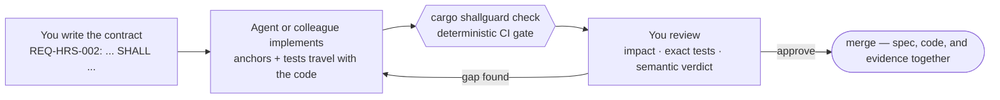
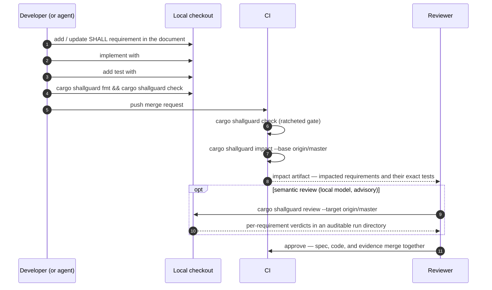
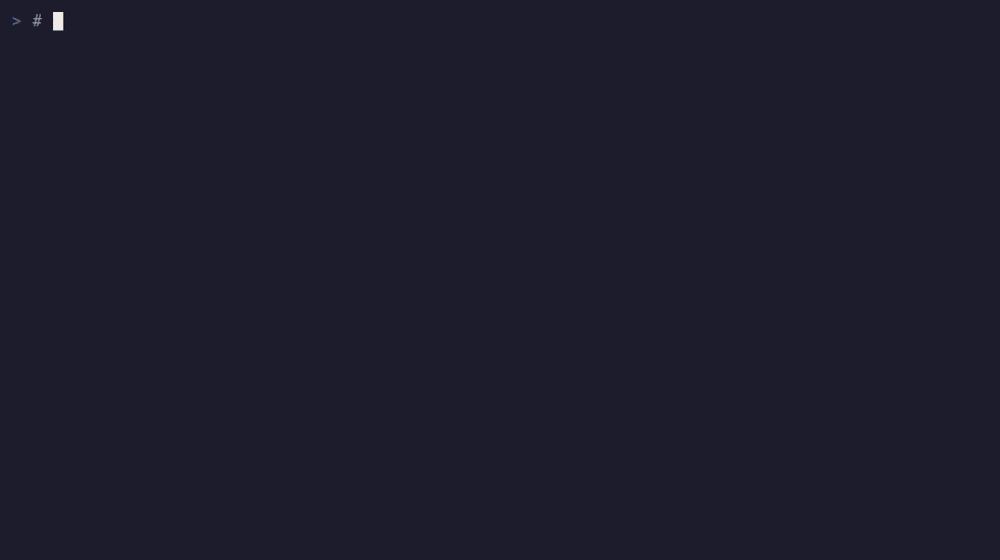
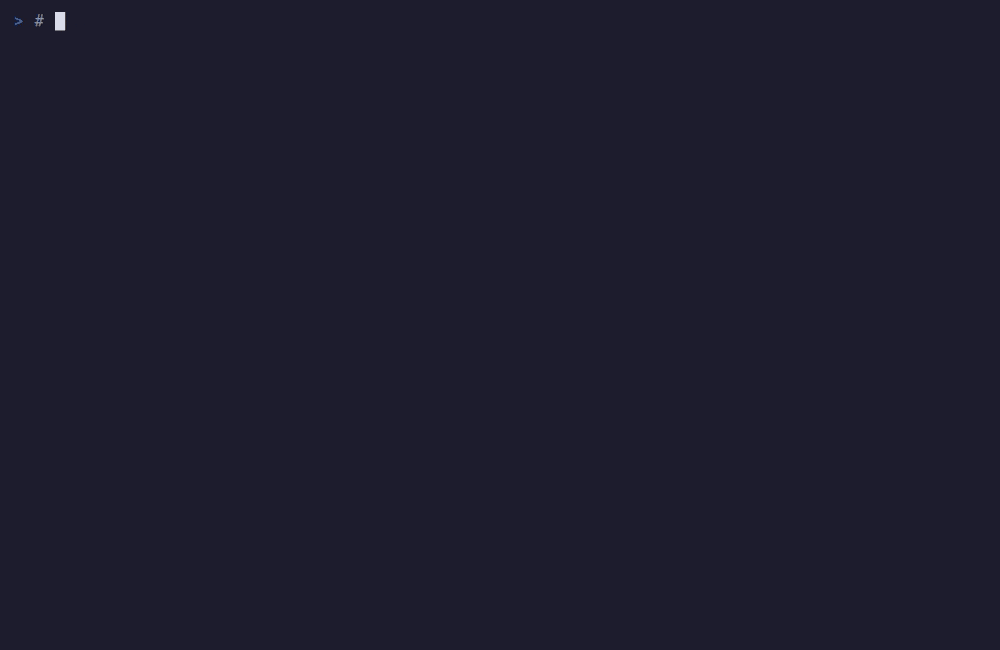
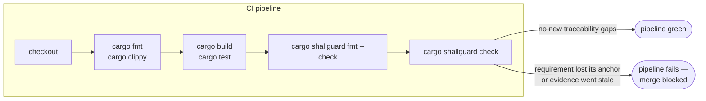

# ShallGuard

ShallGuard is a tool for Rust projects. It keeps a written list of what the
software must do, and it connects each item in that list to the code and the
tests. If a link breaks, the build fails.

This page explains why the tool exists, how it works, and how you install and
use it. The [glossary](docs/GLOSSARY.md) defines each technical term.

## The problem

Code has become cheap to write. Trust has not. A coding agent is a program
that uses a large language model to write code. Agents now write a large part
of the code in many projects.

An agent opens a merge request. A merge request is a proposed change that a
reviewer examines before it goes into the main branch. The change compiles.
Every test passes. The continuous integration (CI) pipeline is green.

The same change has also deleted the test that proves a critical rule. Or it
has changed the test to `assert!(true)`. Nothing in the pipeline sees this.

## The solution

With ShallGuard, the critical rule is a numbered requirement in a Markdown
document. The requirement uses the word SHALL, as defined in the internet
standard RFC 2119. The requirement points at the code that makes it true and
at the test that proves it. The tool calls these links anchors.

The command `cargo shallguard check` reads the document and the code. It
fails in these cases:

- Somebody deletes the test or removes the anchor.
- A requirement claims a test as evidence, but no real test exists.

The check needs no network and no language model. It gives the same result
each time.

This recording shows the full development loop in one terminal session. It
shows a requirement, its anchors, the check, and the check that catches a
deleted test:


## Used in production

The migration workflow has run once at scale, on the author's own production
workspace. The author owns that workspace, so read the numbers as a best case
and not as an independent benchmark.

- The workspace has 3 crates and 535 requirements in 16 areas.
- The first check reported 576 traceability warnings.
- At the end, the committed baseline was empty and every area was hard.
- The migration found real defects that a green test suite had hidden: an
  authorization test that could not fail, an end-to-end test without its
  core component, mocks without assertions, and 2 metric fields that the
  code wrote but never read.

The [migration case study](docs/MIGRATION.md#case-study-a-production-network-service-workspace)
gives the full numbers and their limits.

## How it works

ShallGuard has three parts and one check:

1. **Requirement documents.** Markdown files hold numbered requirements with
   the form `REQ-<AREA>-<NNN>`. Each requirement has an *Enforced:* line that
   names its source locations and a *Verified:* line that names its evidence
   class and its tests. The evidence classes are ASCII keywords: `[test]`,
   `[e2e]`, `[review]`, and `[pending]`. An emoji next to the keyword is
   optional.
2. **Anchors in code.** Attributes and macros mark the code that makes a
   requirement true and the tests that verify it. Each anchor names the
   requirement IDs it serves.
3. **The check.** The command `cargo shallguard check` compares the documents
   with the anchors. It fails when a reference points at nothing, when a
   requirement has no anchor, or when a requirement claims evidence without a
   real test.

The user guide explains
[what the check proves and what it does not prove](docs/USER_DOC.md#what-the-deterministic-gate-does-and-does-not-prove).


The check proves that the link exists. It does not prove the quality of the
evidence behind the link.

Optional commands add more evidence:

- Execution coverage through the tool `cargo-llvm-cov`.
- Impact analysis of a Git change.
- Semantic review by a local language model. This review is advisory, and
  the feature is experimental.

## The name

A requirement written in RFC 2119 style uses the word **SHALL** for a
mandatory behavior. ShallGuard guards the SHALL statements. Each SHALL must
point at the code that makes it true and at the test that proves it. The
check makes sure that a guarded SHALL cannot lose that link without a
failure.

## Installation

Install the published Cargo subcommand:

```bash
cargo install cargo-shallguard --version 0.1.2 --locked
```

Or install from a local copy of this repository:

```bash
cargo install --path cargo-shallguard
```

Or install from one fixed Git commit:

```bash
cargo install \
  --git https://github.com/shallguard/shallguard-rs.git \
  --rev <published-sha> \
  --locked cargo-shallguard
```

The `coverage` command also needs the tool `cargo-llvm-cov`. The `review`
command needs a supported provider program, for example Codex or Claude. The
check does not need a provider.

## Quick start in your repository

Follow these five steps.

**1. Add the library dependency.** The library exports the anchor macros
under the `shallguard` name. You do not need a direct dependency on the macro
crate:

```toml
[dependencies]
shallguard = "0.1.2"
```

**2. Create the file `shallguard.toml`** at the root of the repository. Copy
and adapt the [configuration reference](docs/CONFIGURATION.md):

```toml
schema = 1
minimum_requirements = 1
baseline = ".shallguard/baseline.toml"

[[documents]]
path = "docs/USER_STORIES_AND_REQUIREMENTS.md"
source_root = "."
```

**3. Write a requirement** in the configured document:

```markdown
- **REQ-HRS-002** — The scheduler SHALL never emit a zero worker floor.
  *Enforced:* `src/floor.rs` (`floor`) · *Verified:* [test] ✅ `src/floor.rs`
  (`floor_never_returns_zero`)
```

**4. Anchor the requirement in Rust code:**

```rust
/// Item-level enforcement: this function exists because the contract exists.
#[shallguard::enforces("REQ-HRS-002")]
fn floor(configured: usize) -> usize {
    configured.max(1)
}

/// Branch-level enforcement: anchor the exact statement, arm, or block.
fn resolve(mode: Mode) -> usize {
    match mode {
        Mode::Fixed(n) => {
            shallguard::enforces_here!("REQ-HRS-002");
            n.max(1)
        }
        Mode::Auto => detect(),
    }
}

/// Verification evidence: only a real, non-ignored test counts.
#[shallguard::verifies("REQ-HRS-002")]
#[test]
fn floor_never_returns_zero() {
    assert_eq!(floor(0), 1);
}
```

The relation is many-to-many. One code item can enforce several
requirements. One requirement can have anchors in several places. The
`#[verifies]` attribute rejects a function that is not a test. It also
rejects a test with the `#[ignore]` attribute. Both are compile errors.

**5. Run the checks:**

```bash
cargo shallguard fmt --check   # requirement-block formatting
cargo shallguard check         # traceability gate
```

### Adopt ShallGuard in an existing project

An existing project has gaps. A gap is a requirement without an anchor or
without automated evidence. Record the gaps once in a baseline file, commit
the file, and make it smaller over time. The baseline is a ratchet. It is not
a list of permitted exceptions:

```bash
cargo shallguard baseline init    # record today's known gaps, once
cargo shallguard baseline prune   # drop entries you have since resolved
```

Each new gap fails the check. The check accepts only the gaps that the
committed baseline records. When an area has no gaps left, set its policy to
hard with `hard_enforcement` and `hard_verification`. A hard area cannot go
into the baseline again.

For a large existing codebase, the [migration guide](docs/MIGRATION.md)
describes the full agent-assisted migration:

- An agent recovers the requirements from the code.
- A person reviews every requirement.
- The baseline records the gaps once.
- An agent pays off the gaps batch by batch, and a person verifies each batch.

The guide includes a case study of a production workspace with 535
requirements.

## The human stays in the loop

Coding agents, and people who work with them, produce merge requests faster
than anyone can read them. The merge requests compile and pass the tests. No
agent can decide what the system must do. ShallGuard turns that division of
work into a loop that a machine checks:

- **You own the specification.** You write testable requirements in Markdown
  documents, for example "the scheduler SHALL never emit a zero worker
  floor". The documents are versioned and reviewed like code.
- **Anyone, or any agent, implements.** Each requirement must point at the
  code that makes it true and at the automated test that proves it. New
  behavior arrives with its requirement in the same merge request.
- **The check protects the link.** The check fails the CI pipeline when a
  reference points at nothing, when a requirement has no anchor, or when a
  requirement claims evidence without a real test. The check needs no
  network and no model. The baseline is a ratchet, so the number of gaps can
  only go down.
- **A tool assists the review. You make the decision.** For each merge
  request, the tool maps the change to the affected requirements and runs
  exactly their anchored tests. A local agent can also judge if the change
  still satisfies each requirement. The agent gives an advisory verdict with
  a counterexample. It never merges.



### Review a merge request

The review is the point where the loop pays off. A colleague, an agent, or a
colleague with an agent can write the branch. In all cases the requirement
travels with the code in the same merge request. The reviewer examines the
requirement, the enforcement code, and the evidence as one unit:



This recording shows the review of a colleague's branch. The reviewer maps
the change to the requirements it touches, reads each requirement, and runs
exactly its anchored test:



The impact artifact answers the first two questions of a reviewer: which
requirements does this change touch, and which anchored tests belong to
them? The verdicts from the `review` command are advisory. A failure of the
provider or of the response schema returns a nonzero exit code. A person
decides if the merge request merges.

## Semantic review: catch what green tests miss

The command `cargo shallguard review` runs the full evidence pipeline. It
runs the impact analysis, collects execution coverage with `cargo-llvm-cov`,
builds a bounded review capsule, and gives the capsule to a local agent. The
agent returns a verdict for each requirement.

This feature is experimental, like every feature that needs a language
model. It can change in any release, and its verdicts are advisory. The
[user guide](docs/USER_DOC.md#experimental-features) lists the experimental
features.

In this recording, a colleague adds a new scheduling mode. The code compiles,
passes every test, and keeps the check green. The new code also bypasses the
required worker floor. Coverage proves that the anchored test reaches the
code. Only the semantic review sees that the new match arm violates the
requirement. The review gives a counterexample and a suggested fix:



## CI integration

Add the check after your usual Rust checks. The check is fast. It gives the
same result each time, and it needs no secrets:



This is an example for GitHub Actions:

```yaml
- name: Requirement assurance
  run: |
    cargo install cargo-shallguard --version 0.1.2 --locked
    cargo shallguard fmt --check
    cargo shallguard check
```

The baseline is committed, and it is a ratchet. A branch can keep the number
of gaps equal or make it lower. It cannot make it higher. If a change deletes
a test, removes an anchor, or renames a cited file, the pipeline fails at
once.

### Advisory Copilot pull-request review

This repository also contains the workflow file
`.github/workflows/shallguard-review.yml`. The workflow publishes an optional
semantic review as a pull-request comment and updates the comment on each
run. It keeps the Markdown report and the local review directory as a
workflow artifact. The workflow is experimental, because it needs a language
model provider.

The workflow needs credentials:

- A repository in an organization uses the built-in job token with the
  permission `copilot-requests: write`. The organization must permit Copilot
  CLI requests from Actions.
- If built-in Copilot requests are not available, add a repository Actions
  secret with the name `COPILOT_GITHUB_TOKEN`. The secret holds a
  fine-grained token that a user owns and that has the Copilot Requests
  account permission. The workflow uses that secret first. If the secret is
  absent, the workflow uses the job token.

The advisory workflow has a different trust boundary from the required
`Rust` workflow:

- A preparation job with no secrets and read-only access builds ShallGuard
  from the trusted base revision. It uses that binary to analyze the
  pull-request merge and to create a bounded bundle. It does not run Rust
  code from the pull request.
- A separate job runs only for branches in the same repository. It checks
  out the trusted base revision and gives Copilot only the frozen bundle
  prompt and schema. It disables Copilot tools, remote delegation, custom
  instructions, and interactive prompts.
- A publisher job creates or updates the comment. Missing credentials, an
  unavailable provider, an invalid response, and the verdicts are all
  advisory. They do not replace or weaken the two required commands
  `cargo shallguard-dev fmt --check` and `cargo shallguard-dev check` in
  `.github/workflows/rust.yml`.

You can show the report of any stored run on your machine without a
provider:

```bash
cargo shallguard review show --format markdown
cargo shallguard review show REQ-CLI-001 --format markdown
```

## AI agent skill

In the loop above, agents do the implementation. Agents are also the ones
most likely to satisfy the check in the wrong way:

- They invent evidence citations.
- They delete anchors to remove failures.
- They reword requirements to match the code.
- They remove assertions until a test cannot fail.

The file [`docs/skill/SKILL.md`](docs/skill/SKILL.md) is a self-contained
manual for agents. It describes the requirements-first workflow, the rules
for anchor placement, the rules for honest evidence, the commands of the
check, and a table that maps each failure to the correct response.

The skill is one file with no external references. To install it, copy one
file.

**Claude Code** finds skills automatically. It loads this skill when the
agent works in a repository with a `shallguard.toml` file:

```bash
# For all your projects (personal skill):
mkdir -p ~/.claude/skills/shallguard
cp docs/skill/SKILL.md ~/.claude/skills/shallguard/

# Or committed into one consuming repository (project skill):
mkdir -p .claude/skills/shallguard
cp <shallguard-checkout>/docs/skill/SKILL.md .claude/skills/shallguard/
```

**Codex** [finds skills automatically](https://learn.chatgpt.com/docs/build-skills#where-codex-loads-local-skills)
in `.agents/skills` directories. Install the skill for all repositories, or
commit it into one repository:

```bash
# For all your projects (personal skill):
mkdir -p ~/.agents/skills/shallguard
cp docs/skill/SKILL.md ~/.agents/skills/shallguard/SKILL.md

# Or committed into one consuming repository (project skill):
mkdir -p .agents/skills/shallguard
cp <shallguard-checkout>/docs/skill/SKILL.md \
  .agents/skills/shallguard/SKILL.md
```

Codex loads the full instructions when the description of the skill matches
the task. It finds new and changed skills automatically. If a change does not
appear, restart Codex.

The skill has the same version as this repository. When your repository
moves to a newer `shallguard` release, copy the skill again from the matching
tag.

## Command reference

In a copy of this repository, the command `cargo run -- <arguments>` runs
the `cargo-shallguard` binary. For example, `cargo run -- --version` prints
the version.

| Command | Purpose |
|---|---|
| `cargo shallguard version` / `--version` | Print the installed CLI version. This command does not need a configured repository. |
| `cargo shallguard check` | Compare the requirements with the code anchors and the test anchors. This is the CI gate. |
| `cargo shallguard fmt [--check]` | Format the requirement blocks, or verify their format. |
| `cargo shallguard lint` | Examine the requirement documents without a write. |
| `cargo shallguard baseline <check\|init\|prune>` | Manage the baseline of known gaps. |
| `cargo shallguard impact --base <rev>\|--target <branch>` | Map a Git change to the affected requirements and their tests. Output is JSON or Markdown. |
| `cargo shallguard test-index` | List the exact Cargo tests behind the verification anchors. |
| `cargo shallguard coverage` | Collect LLVM execution evidence for the verification tests. Needs `cargo-llvm-cov`. |
| `cargo shallguard bundle` | Build a bounded source capsule for a review. |
| `cargo shallguard review` | Run an optional semantic review of the affected requirements with a local LLM. The verdicts are advisory. Experimental. |
| `cargo shallguard review show` | Show a stored review as terminal text or as GitHub-flavored Markdown. Experimental. |
| `cargo shallguard clean` | Remove the validated bundle at the configured artifact location. |

The executable finds the Cargo repository with `cargo metadata`. It reads the
policy of the repository from `shallguard.toml`. It supports a single-package
repository and a virtual Cargo workspace.

## Use `shallguard` as a library

The crate exports the anchor macros. It also exports the analysis building
blocks, for example `check`, `scan`, `impact`, `coverage`, `test_index`,
`baseline`, `config`, and `review_workflow`. You can use them in your own
tools:

```rust
use shallguard::config::RepositoryConfig;

fn main() -> anyhow::Result<()> {
    let root = shallguard::workspace_root()?;
    let config = RepositoryConfig::load(&root)?;
    let report = shallguard::check::run(&root, &config.documents(), &config)?;
    if !report.print(10) {
        std::process::exit(1);
    }
    Ok(())
}
```

The library gives the same result for the same input. It does not print to
the terminal, and it does not run a provider. A long operation reports its
progress through an optional callback.

## Develop ShallGuard itself

The workspace contains the `shallguard` library, the `cargo-shallguard`
Cargo subcommand, and the internal procedural-macro crate. The project uses
the [MIT License](LICENSE).

Run these commands before you submit a change:

```bash
cargo fmt --all -- --check
cargo clippy --workspace --all-targets -- -D warnings
cargo test --workspace
cargo +1.89.0 check --workspace --all-targets --locked
cargo shallguard-dev fmt --check
cargo shallguard-dev check
```

The alias `cargo shallguard-dev` runs the binary from this repository. CI
uses the same command. ShallGuard uses itself. Its committed baseline is
empty, and every requirement area is hard. A new gap fails at once.

The other documents are:

- [User guide](docs/USER_DOC.md)
- [Technical documentation](docs/TECHNICAL_DOC.md)
- [Migration guide](docs/MIGRATION.md)
- [Release procedure](docs/RELEASING.md)
- [Configuration reference](docs/CONFIGURATION.md)
- [Glossary](docs/GLOSSARY.md)
- [Documentation style](docs/WRITING_STYLE.md)
- [AI agent skill](docs/skill/SKILL.md)
- [Requirements specification](docs/USER_STORIES_AND_REQUIREMENTS.md)
