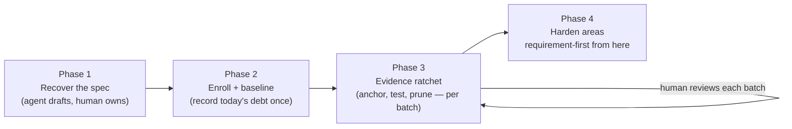

# Migrating an existing codebase to ShallGuard

Most codebases carry *requirement debt*: the behavior lives in code and in
people's heads, not in a managed specification. Nobody had an incentive to
write requirements down — and nothing guarded them once written. This guide
describes an interactive, agent-assisted migration that pays that debt off
incrementally: agents do the archaeology and the test writing, a human owns
every SHALL statement and reviews every batch, and the ratcheted gate makes
sure recovered ground is never lost again.

The process has four phases:



## Phase 0: Prepare

- Install the CLI and add the dependency (see the
  [README quick start](../README.md#quick-start-in-your-repository)).
- Create `shallguard.toml` with one `[[documents]]` entry per specification
  and an `[areas.*]` entry per capability area. Start every area **soft**
  (`hard_enforcement = false`, `hard_verification = false`) — hardening
  comes at the end, per area, once it is clean.
- Install the [AI agent skill](skill/SKILL.md) for whichever agent will do
  the work. It encodes the anchor rules and — critically for migration —
  the evidence-honesty rules the rest of this guide depends on.

## Phase 1: Requirement archaeology — the agent drafts, you own

Instruct the agent to recover user stories and numbered system requirements
from what actually exists: the code, the tests, the docs, the commit
history. A working prompt:

> Read this crate and draft `docs/REQUIREMENTS.md` for ShallGuard: user
> stories with numbered `REQ-<AREA>-<NNN>` system requirements in RFC 2119
> form (SHALL / SHALL NOT / MAY), each with an `*Enforced:*` line citing
> the file and symbol that implements it today and a `*Verified:*` line.
> Be honest about evidence: use ⏳ (pending) or 👁 (code review only) —
> claim ✅ only where a real test already proves the statement, citing the
> exact test file and function. Describe only behavior you can point at in
> the code; if intent is unclear, mark the statement with a question for
> human review instead of guessing. Report honestly; do not hide gaps.

Then the part that cannot be delegated: **a human reviews every SHALL
statement before enrollment.** The specification is the one artifact the
human owns in this whole loop — a wrong requirement recorded as truth is
worse than no requirement, because from now on the tooling will defend it.
Expect this review to surface contradictions between old documents, dead
behavior nobody wants to keep, and intended behavior that was never
implemented (those become honest ⏳ entries, not fake citations).

Normalize and validate the draft:

```bash
cargo shallguard fmt     # canonical requirement-block formatting
cargo shallguard lint    # structural validation without writing
```

## Phase 2: Enroll and record the baseline

With the reviewed document in place, record today's debt **once** and
commit it:

```bash
cargo shallguard baseline init   # e.g. "created .shallguard/baseline.toml
                                 #       with 3 historical gap(s)"
cargo shallguard check           # OK — gaps reported as grandfathered
```


Two properties make this safe to do early:

- **The gate is useful immediately.** Wire `cargo shallguard fmt --check`
  and `cargo shallguard check` into CI now, not after the migration: only
  the exact recorded historical gaps are tolerated, so any *new* unanchored
  behavior fails the pipeline while the old debt is being paid off.
- **The baseline is a ratchet, not an allowlist.** There is no command to
  add entries; `baseline prune` only removes resolved ones. The debt count
  can only go down.

## Phase 3: The evidence ratchet — agent in the loop, human verifies

Work the debt off in reviewable batches. Per-area batches work well (all
requirements of one capability in one merge request); per-requirement is
fine for hairy contracts. For each batch, the agent:

1. **Anchors the enforcement sites** — `#[shallguard::enforces]` on the
   item that actually implements the SHALL statement (or
   `enforces_here!` for a branch or match arm), never on the nearest
   convenient public function.
2. **Provides verification evidence** — anchor an *existing* test with
   `#[shallguard::verifies]` only after reading it and confirming it would
   fail if the contract broke; otherwise write a new test that does. Flip
   the document line from ⏳ to ✅ with the exact citation:
   `*Verified:* ✅ \`src/lib.rs\` (\`backoff_is_capped_at_sixty_seconds\`)`.
3. **Proves and prunes:**

   ```bash
   cargo test
   cargo shallguard fmt --check
   cargo shallguard check
   cargo shallguard baseline prune   # "pruned 1 resolved gap(s); 2 remain"
   ```

4. **Hands the batch to a human.** The reviewer sees spec, anchors, tests,
   and the shrinking baseline in one diff — `cargo shallguard impact` and
   the advisory `cargo shallguard review` work here exactly as in ordinary
   [merge-request review](../README.md#reviewing-a-merge-request).


Progress is visible, not vibes: the per-area table from `cargo shallguard
check` (anchored / tested / pending counts) plus the baseline gap count are
the migration dashboard. Both trend monotonically toward zero.

### Upgrading the tool mid-migration

A newer ShallGuard release may detect gap kinds an older release could
not (the vacuity lints are one). Pre-existing gaps of such a kind are
historical debt, not new regressions, and there is a dedicated ratchet
path for them:

```bash
cargo shallguard baseline extend   # records gaps from detector schemas
                                   # newer than the committed capability
```

`extend` refuses hard gaps and records only eligible non-advisory debt. A
successful run advances the baseline's detector capability even when there is
nothing to add, closing the upgrade window so future gaps remain hard
regressions. Ordinary maintenance stays removal-only.

## Phase 4: Harden, then develop requirement-first

When an area has no remaining gaps in a dimension, flip it to
`hard_enforcement = true` / `hard_verification = true` in
`shallguard.toml`. Hard areas can never be baselined again — the ratchet
is locked for good. When every area is hard and the committed baseline is
empty, the migration is done, and the ordinary
[requirement-first workflow](../README.md#why-now-the-human-stays-in-the-loop)
takes over: new behavior arrives with its contract, anchors, and evidence
in the same merge request.

## Case study: a production network service workspace

The migrated workspace is the author's own production system; read the
numbers as a founder-run best case, not an independent benchmark. In
particular, the two-day figure below was possible because the specification
largely already existed in the author's head — a team migrating unfamiliar
code should expect the human SHALL review, not the agent work, to be the
pacing constraint, for the reason stated above: a wrong requirement
recorded as truth is worse than none.

This process was used to migrate a production Rust workspace (three member
crates — a network service, a routing library, and a protocol crate) whose
two behavioral crates carried **535 requirements across 16 areas** in two
specification documents (~5,400 documentation lines). The starting point
was prose user stories with no machine link to the code: the first checker
run reported **576 warnings** across both dimensions, with zero hard areas.

How it went:

- **Waves, not requirements.** The human drove the loop with one-line
  instructions ("do the anchor pass for these areas", "ratchet the next
  two", "what's next?"), while agents worked **per-area batches in four
  waves of 3–4 areas**, each wave fenced to one crate and one document and
  explicitly instructed to *report honestly, not hide gaps*.
- **Anchors and ratchet flips were separate commits**, so reviewers could
  read the coverage work without configuration noise, and each hardening
  step was its own auditable decision.
- **Two days later:** zero errors and warnings, 462/462 anchorable
  requirements code-anchored, every ✅ claim bound to a real anchored test,
  all 16 areas hard on both dimensions, committed baseline empty.
- **Evidence campaigns continued after adoption**, upgrading 👁
  (code-review-only) evidence to ✅ automated tests area by area —
  ✅ went from 194 to 274 requirements with ~4,500 lines of asserting
  tests, and every remaining 👁 carries a written structural reason.

What the migration surfaced — and why the honesty rules exist:

1. **False ✅ is the default failure mode.** Review passes caught a vacuous
   authorization test (asserting on input the parser rejects, so the
   assertion never fired), an end-to-end test with the core component
   missing, and mocks that asserted nothing. Each was fixed or honestly
   downgraded — never anchored as-is. These are exactly the patterns
   [issue #13](https://github.com/sigi64/shallguard/issues/13) proposes to
   detect deterministically; the migration found them empirically first.
2. **Anchoring surfaces real drift.** Two metric fields had silently become
   write-only after a refactor; the requirement forced an explicit
   keep-or-retire decision instead of continued rot.
3. **Unimplemented SHALLs become ⏳, not fake citations** — the migration
   found specified-but-missing behavior and recorded it as pending work.
4. **Requirement wording comes first.** Prose stories had to be rewritten
   into numbered, testable SHALL statements — and contradictions between
   document sections were fixed as part of that rewrite, before any
   tooling could defend them.

The demo GIFs above are a miniature of exactly this process; the case
study is what it looks like at 535-requirement scale.
