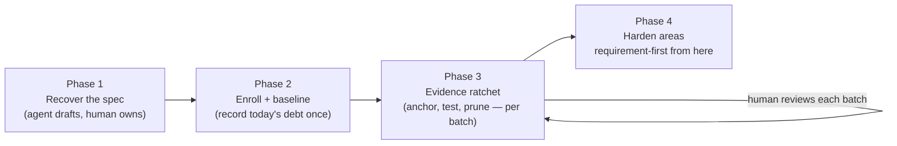

# Migrating an existing codebase to ShallGuard

This guide is for a team that adopts ShallGuard in a codebase that already
exists. The [glossary](GLOSSARY.md) defines each technical term.

Most codebases carry requirement debt. The behavior lives in the code and in
the heads of the people. It does not live in a managed specification. Nobody
had a reason to write the requirements down, and nothing protected the
requirements that somebody did write down.

This guide describes an interactive migration with the help of a coding
agent. The migration pays the debt off in small steps:

- The agent recovers the requirements from the code and writes the tests.
- A person owns every requirement and reviews every batch.
- The check makes sure that recovered ground stays recovered.

The process has four phases:



## Phase 0: Prepare

1. Install the command and add the library dependency. The
   [README quick start](../README.md#quick-start-in-your-repository) shows
   how.
2. Create `shallguard.toml`. Add one `[[documents]]` entry for each
   requirement document and one `[areas.*]` entry for each capability area.
   Start every area soft. That is, set `hard_enforcement = false` and
   `hard_verification = false`. You make an area hard at the end, one area
   at a time, when the area has no gaps.
3. Install the [AI agent skill](skill/SKILL.md) for the agent that does the
   work. The skill contains the anchor rules and the evidence rules. The
   rest of this guide depends on the evidence rules.

## Phase 1: Recover the requirements

In this phase the agent writes the draft, and you own the result.

Instruct the agent to recover user stories and numbered requirements from
what exists: the code, the tests, the documents, and the commit history.
This prompt works:

> Read this crate and write `docs/REQUIREMENTS.md` for ShallGuard. Write
> user stories with numbered `REQ-<AREA>-<NNN>` system requirements in
> RFC 2119 form (SHALL / SHALL NOT / MAY). Give each requirement an
> `*Enforced:*` line that names the file and the symbol that implements it
> today, and a `*Verified:*` line. Be honest about the evidence. Use ⏳
> (pending) or 👁 (code review only). Write ✅ only where a real test proves
> the statement, and name the exact test file and test function. Describe
> only behavior that you can point at in the code. If the intent is not
> clear, mark the statement with a question for human review. Do not guess.
> Report honestly. Do not hide gaps.

The next step cannot go to the agent. **A person reviews every requirement
before enrollment.** The specification is the one artifact that a person
owns in this loop. A wrong requirement that the document records as true is
worse than no requirement, because from that moment the tool defends it.
Expect the review to find contradictions between old documents, dead
behavior that nobody wants, and intended behavior that nobody implemented.
Record intended behavior as an honest ⏳ entry, not as a false citation.

Then normalize and validate the draft:

```bash
cargo shallguard fmt     # canonical requirement-block formatting
cargo shallguard lint    # structural validation without writing
```

## Phase 2: Enroll and record the baseline

When the reviewed document is in place, record the gaps of today once, and
commit the baseline:

```bash
cargo shallguard baseline init   # e.g. "created .shallguard/baseline.toml
                                 #       with 3 historical gap(s)"
cargo shallguard check           # OK — gaps reported as grandfathered
```


Two properties make this safe at an early stage:

- **The check is useful at once.** Add `cargo shallguard fmt --check` and
  `cargo shallguard check` to CI now, not after the migration. The check
  accepts only the gaps that the baseline records. Any new behavior without
  an anchor fails the pipeline while the team pays off the old debt.
- **The baseline is a ratchet, not a list of exceptions.** No command adds
  an entry. The command `baseline prune` only removes resolved entries. The
  number of gaps can only go down.

## Phase 3: Pay off the gaps

In this phase the agent works, and a person verifies each batch.

Pay off the gaps in batches that a reviewer can read. A batch for one area
works well. That is, one merge request holds all requirements of one
capability. For a difficult requirement, a batch with one requirement is
also fine. For each batch, the agent does these steps:

1. **Anchor the enforcement sites.** Put `#[shallguard::enforces]` on the
   item that implements the requirement. Use `enforces_here!` for a branch
   or a match arm. Do not put the anchor on the nearest public function.
2. **Give verification evidence.** Read an existing test first. Anchor the
   test with `#[shallguard::verifies]` only if the test fails when the
   requirement breaks. If no such test exists, write one. Then change the
   document line from ⏳ to ✅ with the exact citation, for example
   `*Verified:* ✅ \`src/lib.rs\` (\`backoff_is_capped_at_sixty_seconds\`)`.
3. **Prove and prune:**

   ```bash
   cargo test
   cargo shallguard fmt --check
   cargo shallguard check
   cargo shallguard baseline prune   # "pruned 1 resolved gap(s); 2 remain"
   ```

4. **Give the batch to a person.** The reviewer sees the requirements, the
   anchors, the tests, and the smaller baseline in one diff. The commands
   `cargo shallguard impact` and `cargo shallguard review` work here in the
   same way as in an ordinary
   [merge-request review](../README.md#review-a-merge-request).


The progress is visible. The check prints a table for each area with the
anchored, tested, and pending counts. That table and the number of gaps in
the baseline are the dashboard of the migration. Both go down to zero.

## Phase 4: Make the areas hard, then develop requirement-first

When an area has no gaps of one kind, set `hard_enforcement = true` or
`hard_verification = true` for that area in `shallguard.toml`. A hard area
cannot go into the baseline again. The ratchet is locked.

The migration is complete when every area is hard and the committed baseline
is empty. From that point, the usual
[requirement-first workflow](../README.md#the-human-stays-in-the-loop)
applies. New behavior arrives with its requirement, its anchors, and its
evidence in the same merge request.

## Case study: a production network service workspace

The migrated workspace is the production system of the author. Read the
numbers as a best case and not as an independent benchmark. The migration
took two days because the specification already existed in the head of the
author. A team that migrates unfamiliar code must expect the human review of
the requirements to be the slowest step. The reason is the one given above:
a wrong requirement that the document records as true is worse than none.

The workspace is a production Rust workspace with 3 crates: a network
service, a routing library, and a protocol crate. The 2 crates with behavior
had 535 requirements in 16 areas, in 2 requirement documents of about 5,400
lines. At the start, the documents held prose user stories with no link to
the code. The first check reported 576 warnings for both kinds of gaps. No
area was hard.

The migration went as follows:

- **Waves, not single requirements.** A person drove the loop with one-line
  instructions, for example "do the anchor pass for these areas", "ratchet
  the next two", and "what is next?". Agents worked in batches of one area,
  in 4 waves of 3 to 4 areas. Each wave stayed inside one crate and one
  document. Each wave had the explicit instruction to report honestly and
  not to hide gaps.
- **Anchors and ratchet changes were separate commits.** A reviewer can
  read the anchor work without configuration noise. Each step that made an
  area hard was its own decision with its own audit trail.
- **After two days,** the check reported zero errors and zero warnings. All
  462 requirements that can have an anchor had one. Every ✅ claim pointed
  at a real anchored test. All 16 areas were hard for both kinds of gaps.
  The committed baseline was empty.
- **Evidence campaigns continued after the adoption.** The team upgraded 👁
  evidence to ✅ automated tests, one area at a time. The number of ✅
  requirements went from 194 to 274, with about 4,500 lines of tests with
  assertions. Every remaining 👁 entry has a written structural reason.

The migration found four kinds of problems. They are the reason for the
honesty rules:

1. **A false ✅ is the most common failure.** The review passes found an
   authorization test that could not fail, because it asserted on an input
   that the parser rejects. They found an end-to-end test without its core
   component. They found mocks with no assertions. Each test was fixed or
   honestly downgraded. No test was anchored as it was. These are the
   patterns that
   [issue #13](https://github.com/sigi64/shallguard/issues/13) proposes to
   detect with a deterministic check. The migration found them by hand
   first.
2. **Anchors show real drift.** Two metric fields had become write-only
   after a refactor. Nobody read them. The requirement forced an explicit
   decision to keep or retire them.
3. **A requirement without an implementation becomes ⏳.** The migration
   found specified behavior that the code did not have. The document records
   it as pending work, not as a false citation.
4. **The wording of a requirement comes first.** The team had to rewrite the
   prose stories into numbered, testable SHALL statements. The rewrite fixed
   contradictions between document sections before the tool started to defend
   them.

The recordings above show a small version of this process. The case study
shows the same process with 535 requirements.
