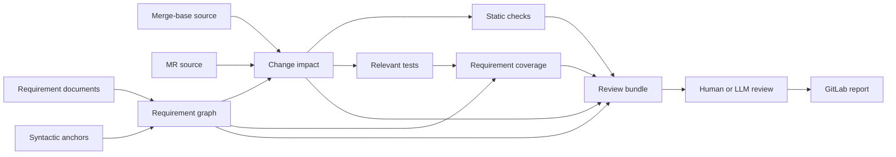

# Requirement Assurance Design

**Status:** Partially implemented

This document defines the architecture that extends the existing requirement
traceability check of the workspace. A workspace is a set of Rust packages that
Cargo builds together. Cargo is the build tool of Rust. Traceability is the
recorded link between a requirement, the code that enforces it, and the
evidence for it. The extension adds 4 functions:

- change-impact analysis,
- requirement-aware test coverage,
- static checking, and
- bounded review with the help of a large language model (LLM).

An LLM is a program that reads and writes natural language. Coverage is a
record of the source lines that a test executes.

The existing traceability model and the mandatory developer workflow stay
defined in [Requirement Traceability](REQUIREMENT_TRACEABILITY.md). The design
in this document adds evidence layers and review layers. It does not change the
meaning of `#[shallguard::enforces]`, `shallguard::enforces_here!`,
`#[shallguard::verifies]`, or the existing `Requirements checks` CI gate.
Continuous integration (CI) is the automated pipeline that builds and tests
each change. A CI gate is a CI job that must pass before a change can merge.
`#[shallguard::enforces]` and `shallguard::enforces_here!` are enforcement
anchors. An enforcement anchor links Rust code to a requirement.
`#[shallguard::verifies]` is a verification anchor. A verification anchor links
a Rust test to a requirement.

The following documents give the detailed designs:

- [Requirement Traceability Baseline Design](requirement-traceability-baseline-design.md)
- [Requirement Change Impact Design](requirement-change-impact-design.md)
- [Requirement Static Checking Design](requirement-static-checking-design.md)
- [Requirement Coverage Design](requirement-coverage-design.md)
- [Requirement LLM Review Design](requirement-llm-review-design.md)

The current implementation includes these parts:

- the traceability baseline, which does not use fingerprints;
- the base and head impact artifacts for Rust code and for requirements;
- the publication of artifacts to GitLab;
- deterministic review capsules, one for each requirement, with bounded
  current source for every selected enforcement anchor;
- exact Cargo test identities;
- isolated LLVM enforcement-reach artifacts, one for each test;
- resumable advisory model review, local or in CI.

A baseline is a list of accepted historical traceability gaps. The repository
owns the list. A merge request (MR) is a proposed change that a reviewer
examines before it is merged. The base is the most recent commit that the MR and
its target branch have in common. The head is the last commit of the MR.
An artifact is a machine-readable file that a tool writes. GitLab is the
service that hosts the repository and runs CI. A capsule is a bounded bundle of
requirement text, source, changes, and evidence for a review. LLVM is the
compiler back end of Rust. It can record the source lines that a test
executes.

These parts stay proposed:

- changed-region coverage,
- static check registration and static check backends, and
- MR line annotations.

## 1. Problem statement

The current check answers deterministic questions about traceability. A
deterministic result is the same each time for the same input. The questions
are:

- Is every referenced requirement defined?
- Does the documented enforcement file contain an enforcement anchor?
- Does each automated evidence citation resolve to a real, enabled test that
  has `#[shallguard::verifies]`?

The check does not try to answer whether the code satisfies the meaning of an
arbitrary natural-language requirement. This limit is intentional. The check
also does not yet answer 3 other questions:

- Which requirements can an MR affect?
- Do the relevant tests execute the changed enforcement paths?
- How does a reviewer prepare a focused semantic review?

The proposed system SHALL add those capabilities while keeping four different
claims separate:

1. **Traceability:** code and evidence are linked to a requirement.
2. **Impact:** a change may affect a requirement.
3. **Evidence:** static checks or tests exercise an expressed property.
4. **Judgment:** a reviewer assesses whether the change satisfies the complete
   natural-language contract.

A report must not present a coverage number or an LLM verdict as formal proof.

## 2. Goals

The design has these goals:

- Map the Rust changes in an MR to the requirements that they affect directly
  or transitively. A transitive effect passes through one or more other items.
- Report changes that carry behavior but have no association with a
  requirement.
- Run only the requirement evidence that is relevant to an MR, when this is
  possible.
- Project source-based coverage onto enforcement scopes and changed regions.
- Support checks of syntax, types, and control flow that are specific to a
  requirement.
- Produce a deterministic, versioned review bundle that a human or an LLM can
  use. A review bundle is a set of files that a review consumes.
- Return findings to GitLab that name a file and a line.
- Keep the deterministic CI gates independent from the availability of a model
  and from the output of a model.
- Keep enough provenance to reproduce every report. Provenance is the record of
  the inputs and the versions that made a report.

## 3. Non-goals

The design does not have these goals:

- Prove an arbitrary RFC 2119 statement directly from prose. RFC 2119 is the
  standard that defines the words SHALL, SHALL NOT, and MAY in a requirement.
- Replace Rust compilation, Clippy, tests, or human code review. Clippy is the
  lint tool of Rust.
- Send the complete repository to a model.
- Treat execution coverage as evidence that the assertions are correct.
- Build a complete Rust call graph with `syn` alone. `syn` is a Rust library
  that parses Rust source code into a syntax tree.
- Make network access or an LLM a prerequisite for `shallguard`.
- Change requirements, code, tests, or MR approvals automatically.

## 4. Assurance model

The system reports independent evidence dimensions. It does not report one
aggregate "requirement coverage" percentage. Some mechanisms use an abstract
syntax tree (AST). An AST is the structure that a parser builds from source
code. HIR and MIR are internal representations of the Rust compiler. Mutation
testing inserts a deliberate defect into the code and examines whether a test
fails. The dimensions are:

| Dimension | Question | Primary mechanism |
|-----------|----------|-------------------|
| Specification | Is the requirement well-formed and current? | `shallguard` document parser |
| Traceability | Are the implementation and the evidence linked? | Existing anchors and checker |
| Change ownership | Which requirements own the changed behavior? | Comparison of the base AST and the head AST |
| Static assurance | Do the invariants that a machine can express hold? | AST rules, later HIR and MIR lints |
| Test result | Do the cited tests compile and pass? | Cargo test execution |
| Enforcement reach | Do the verifying tests execute the enforcement scopes? | LLVM source coverage |
| Patch exercise | Do the verifying tests execute the changed executable regions? | Diff plus LLVM coverage |
| Test sensitivity | Do plausible violations make the evidence fail? | Targeted mutation testing |
| Semantic review | Does the complete change satisfy each requirement? | Human or LLM review |
| Formal assurance | Is a formal predicate proven? | Types, model checking, contracts |

Each result must name the dimension that it supports. For example, a report
must not shorten "test reached enforcement" to "requirement verified".

## 5. Architecture

The following diagram shows the flow of data between the components:



### 5.1 Components

The implementation stays in the internal `shallguard` crate. A crate is a Rust
package. The crate is exposed as one Cargo subcommand:

```text
cargo shallguard check                    existing traceability gate
cargo shallguard impact --base <sha>      MR impact analysis
cargo shallguard bundle --impact <file>   deterministic review bundle
cargo shallguard coverage                 verification-test enforcement reach
cargo shallguard review                   orchestrated local review (Codex + coverage)
```

The exact CLI names are provisional. A command-line interface (CLI) is the set
of commands that a user types. The stable interfaces are the versioned JSON
artifacts, not the terminal text. JSON is a text format for structured data.

The LLM adapter SHOULD be a separate job or process that consumes a bundle. The
deterministic check must not contain the LLM adapter.

### 5.2 Requirement graph

The shared graph is the core intermediate representation. An intermediate
representation is a data structure that the tool builds from its inputs and
uses in all later steps. The graph has this shape:

```text
Requirement
  -> EnforcementSite
  -> VerificationTest
  -> RelatedRequirement
  -> StaticCheck
  -> ExternalEvidence

SourceNode
  -> ParentNode
  -> ChildNode
  -> SyntacticDependency
  -> Requirement

VerificationTest
  -> Requirement
  -> CargoTestIdentity
  -> CoverageProfile
```

The tool builds the graph deterministically from 4 inputs. The inputs are the
requirement documents, the source anchors, the Cargo metadata, and the selected
Git revisions. Git is the version control system that stores the repository.
Model output never changes the graph.

## 6. Source scopes

Every enforcement anchor needs a source scope. The source scope lets the tool
map a change and a coverage region to the anchor. The scopes are:

| Anchor | Source scope |
|--------|--------------|
| `#[shallguard::enforces]` on an item | The complete annotated item |
| `#[shallguard::enforces]` on a field | The field declaration |
| `#[shallguard::enforces]` on a variant | The variant declaration and its fields |
| `shallguard::enforces_here!` | The smallest enclosing executable block |
| `#[shallguard::verifies]` | The complete test function |

The existing convention requires that `shallguard::enforces_here!` is the first
statement of the relevant branch block or match-arm block. Under this design,
the enclosing block is therefore the scope of the anchor. This can produce too
much false impact. In that case, a future scoped macro can wrap and emit an
explicit block. The first implementation does not require that macro.

The line of an anchor is presentation data. Identity and comparison use the
owning crate, the module path, the item kind, the symbol name, and the
normalized syntax.

## 7. Deterministic and advisory boundaries

### 7.1 Deterministic failures

A hard finding is a finding that fails CI. The following findings can fail CI
without the involvement of a model:

- An existing hard finding of `shallguard`.
- A changed or new requirement that lacks a mandatory anchor or mandatory
  evidence.
- The loss or the invalidation of an anchor that was valid before.
- An automated evidence citation that no longer resolves.
- The failure of a cited test that the tool selected for execution.
- Invalid or non-reproducible input for the review bundle.

A future static check can become hard only when its semantics and its
false-positive rate are known.

### 7.2 Advisory findings

These findings start as warnings or as review annotations:

- A possible transitive impact on a requirement.
- Changed executable code that has no associated requirement.
- A relevant test that does not reach an enforcement scope.
- A changed enforcement region that the relevant tests do not exercise.
- A requirement-directed mutant that survives. A mutant is a copy of the code
  with one deliberate defect. A mutant survives when no test fails.
- LLM findings and LLM verdicts.

An advisory result can become a gate later only through an explicit policy
change. Repository evidence must support that policy change.

## 8. Static checking extension points

Natural-language requirements differ in how directly a tool can check them.

### 8.1 Syntax checks

Rules that use `syn` are appropriate for properties such as these:

- A metric registration has no label dimensions.
- An enum contains a required variant.
- A configuration default uses a specific literal.
- A forbidden API path appears in the syntax.
- A required guard or a required error arm exists in an anchored item.

These rules are fast and stable. They cannot resolve types or trait dispatch.

### 8.2 Compiler-semantic checks

Rules that use HIR or MIR are appropriate for properties such as these:

- All mutation paths require a validated capability value.
- No code can bypass a checked constructor.
- Every control-flow path validates the evidence before a router mutation.
- All trait implementations obey a structural restriction.

These rules require a custom lint or a custom compiler driver. They therefore
require a pinned Rust toolchain and an explicit maintenance owner. This is a
later phase. It is not a prerequisite for impact analysis.

### 8.3 Executable and formal properties

Where possible, express a requirement as a property, not as an example-only
test. A developer can also encode a high-value invariant in types, in model
checking, or in contracts. These mechanisms produce stronger evidence than an
LLM interpretation of prose.

## 9. Artifact and versioning policy

A schema defines the structure of an artifact. Every machine-readable artifact
SHALL include:

- schema name and version;
- repository identifier;
- merge-base and head commit IDs;
- dirty-worktree state for local runs;
- requirement-document hashes;
- Rust toolchain and checker versions;
- enabled Cargo features and selected targets;
- generation timestamp;
- content digest of the artifact.

Paths are relative to the workspace. Source coordinates are one-based line
numbers and column numbers. Where a normalized symbol identity is available,
the coordinates also include it.

A schema change that breaks backward compatibility increments the major
version. A consumer must reject an unknown major version. It must not guess.

## 10. CI shape

The intended MR pipeline has these steps:

1. The existing `Requirements checks` gate runs first.
2. The impact analysis generates `requirement-impact.json` and a short Markdown
   summary.
3. The relevant static checks and the relevant tests run.
4. An optional coverage step produces `requirement-coverage.json`.
5. The bundle generation produces one manifest and one capsule for each
   impacted requirement.
6. An isolated optional job submits the capsules for LLM review.
7. The pipeline publishes the findings as job artifacts. Where GitLab supports
   it, the pipeline also publishes them as MR code annotations.

The core pipeline stays useful when the coverage infrastructure or the LLM
service is not available.

## 11. Rollout

### Phase 0: traceability regression baseline

- Record the existing warning gaps by requirement ID and by gap kind.
- Reject new gaps and reintroduced gaps in every area.
- Require the removal of stale entries as the debt is resolved.
- Keep the existing hard-area policy.

### Phase 1: deterministic impact

- Index the AST of the base and the AST of the head.
- Detect direct requirement impact.
- Detect impact through one hop of callable dependency or structural
  dependency, derived from the syntax.
- Reject an edit to a baselined requirement until its inherited gaps are fixed.
- Detect requirement changes and evidence changes.
- Detect deleted anchors and moved anchors.
- Report unclaimed changes.
- Write versioned JSON output.

### Phase 2: deterministic review bundle

- Include the complete text of each requirement.
- Include each changed item before and after the change.
- Include the enforcement sites and the verification sites.
- Include the related requirements.
- Include the static findings and the ordinary test results.

### Phase 3: requirement coverage

- Exact Cargo test identity. This is implemented in
  `requirement-test-index/v1`.
- Per-test coverage profiles for selected requirements. This is implemented in
  `requirement-coverage/v1`. The selection driven by impact is not implemented
  yet.
- Enforcement reach. This is implemented for function bodies, branch blocks,
  const and static initializers, and structural classification.
- Changed-region exercise and branch exercise.
- Advisory GitLab reporting.

### Phase 4: LLM review

- Model requests and model responses that a schema constrains.
- Isolation against prompt injection. Prompt injection is an attack in which
  text in the input tries to give instructions to the model.
- Provenance, caching, and evaluation against known changes.
- Advisory MR findings.

### Phase 5: stronger assurance

- AST, HIR, and MIR checks that are specific to a requirement.
- Requirement-directed mutation testing.
- Property tests and formal models for selected safety requirements.

## 12. Success criteria

The design is successful when all of these statements are true:

- The tool identifies the owning requirement when an MR changes an enforcement
  site. The identification does not depend on line-number conventions.
- The tool conservatively reports a changed helper that enforcement code uses.
- Reviewers can see behavioral changes that have no associated requirement.
- The tool attributes relevant test evidence and coverage evidence to a
  requirement.
- The LLM sees only a bounded, reproducible review capsule.
- The deterministic checks stay reproducible without an LLM.
- Reports state the evidence precisely. Reports never collapse the evidence
  into a misleading claim of proof.
