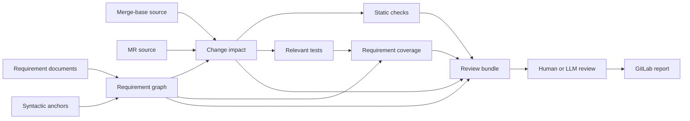

# Requirement Assurance Design

**Status:** Partially implemented

This document defines the architecture for extending the workspace's existing
requirement traceability checks into change-impact analysis, requirement-aware
test coverage, static checking, and bounded LLM-assisted review.

The existing traceability model and mandatory developer workflow remain defined
in [Requirement Traceability](REQUIREMENT_TRACEABILITY.md). The design here adds
evidence and review layers; it does not change the meaning of `#[enforces]`,
`enforces_here!`, `#[verifies]`, or the existing `Requirements checks` CI gate.

Detailed designs:

- [Requirement Traceability Baseline Design](requirement-traceability-baseline-design.md)
- [Requirement Change Impact Design](requirement-change-impact-design.md)
- [Requirement Static Checking Design](requirement-static-checking-design.md)
- [Requirement Coverage Design](requirement-coverage-design.md)
- [Requirement LLM Review Design](requirement-llm-review-design.md)

Current implementation includes the fingerprint-free traceability baseline,
base/head Rust and requirement impact artifacts, GitLab artifact publication,
deterministic per-requirement review capsules with bounded current source for
every selected enforcement anchor, exact Cargo test identities, isolated
per-test LLVM enforcement-reach artifacts, and resumable local/CI advisory
model review. Changed-region coverage, static check registration/backends, and
MR line annotations remain proposed.

## 1. Problem statement

The current system answers deterministic traceability questions:

- Is every referenced requirement defined?
- Does the documented enforcement file carry an enforcement anchor?
- Does automated evidence resolve to a real, enabled test carrying
  `#[verifies]`?

Those checks deliberately do not answer whether arbitrary natural-language
requirements are semantically satisfied. They also do not yet answer which
requirements an MR may affect, whether the relevant tests execute the changed
enforcement paths, or how to prepare a focused semantic review.

The proposed system SHALL add those capabilities while keeping four different
claims separate:

1. **Traceability:** code and evidence are linked to a requirement.
2. **Impact:** a change may affect a requirement.
3. **Evidence:** static checks or tests exercise an expressed property.
4. **Judgment:** a reviewer assesses whether the change satisfies the complete
   natural-language contract.

No coverage number or LLM verdict shall be presented as formal proof.

## 2. Goals

- Map Rust changes in an MR to the requirements they directly or transitively
  affect.
- Report behavior-bearing changes that have no requirement association.
- Run only the requirement evidence relevant to an MR when possible.
- Project source-based coverage onto enforcement scopes and changed regions.
- Support requirement-specific syntax, type, and control-flow checks.
- Produce a deterministic, versioned review bundle suitable for humans or an
  LLM.
- Return file- and line-addressable findings to GitLab.
- Keep deterministic CI gates independent from model availability or model
  output.
- Preserve enough provenance to reproduce every report.

## 3. Non-goals

- Proving arbitrary RFC 2119 statements directly from prose.
- Replacing Rust compilation, Clippy, tests, or human code review.
- Sending the complete repository to a model.
- Treating execution coverage as evidence that assertions are correct.
- Building a complete Rust call graph using `syn` alone.
- Making network access or an LLM a prerequisite for `req-trace`.
- Automatically modifying requirements, code, tests, or MR approvals.

## 4. Assurance model

The system reports independent evidence dimensions instead of one aggregate
"requirement coverage" percentage.

| Dimension | Question | Primary mechanism |
|-----------|----------|-------------------|
| Specification | Is the requirement well-formed and current? | `req-trace` document parser |
| Traceability | Are implementation and evidence linked? | Existing anchors and checker |
| Change ownership | Which requirements own the changed behavior? | Base/head AST comparison |
| Static assurance | Do machine-expressible invariants hold? | AST rules, later HIR/MIR lints |
| Test result | Do the cited tests compile and pass? | Cargo test execution |
| Enforcement reach | Do verifying tests execute enforcement scopes? | LLVM source coverage |
| Patch exercise | Do verifying tests execute changed executable regions? | Diff plus LLVM coverage |
| Test sensitivity | Would plausible violations fail the evidence? | Targeted mutation testing |
| Semantic review | Does the complete change satisfy each clause? | Human or LLM review |
| Formal assurance | Is a formal predicate proven? | Types, model checking, contracts |

Each result must name the dimension it supports. For example, "test reached
enforcement" must not be shortened to "requirement verified."

## 5. Architecture



### 5.1 Components

The implementation remains in the internal `req-trace` crate and is exposed as
one Cargo subcommand:

```text
cargo req-cov check                    existing traceability gate
cargo req-cov impact --base <sha>      MR impact analysis
cargo req-cov bundle --impact <file>   deterministic review bundle
cargo req-cov coverage                 verification-test enforcement reach
cargo req-cov review                   orchestrated local review (Codex + coverage)
```

The exact CLI names are provisional. The stable interfaces are the versioned
JSON artifacts, not terminal text.

The LLM adapter SHOULD be a separate job or process that consumes a bundle. It
must not be embedded into the deterministic checker.

### 5.2 Requirement graph

The shared graph is the core intermediate representation:

```text
Requirement
  -> EnforcementSite
  -> VerificationTest
  -> RelatedRequirement
  -> StaticCheck
  -> ExternalEvidence

SourceNode
  -> ParentNode
  -> ChildNode
  -> SyntacticDependency
  -> Requirement

VerificationTest
  -> Requirement
  -> CargoTestIdentity
  -> CoverageProfile
```

The graph is built deterministically from requirement documents, source
anchors, Cargo metadata, and the selected Git revisions. Model output never
modifies it.

## 6. Source scopes

Every enforcement anchor needs a source scope so a change and a coverage region
can be mapped to it.

| Anchor | Source scope |
|--------|--------------|
| `#[enforces]` on an item | The complete annotated item |
| `#[enforces]` on a field | The field declaration |
| `#[enforces]` on a variant | The variant declaration and fields |
| `enforces_here!` | The smallest enclosing executable block |
| `#[verifies]` | The complete test function |

The existing convention requires `enforces_here!` to be the first statement of
the relevant branch or match-arm block. Under this design the enclosing block is
therefore its scope. If this produces excessive false impact, a future scoped
macro may wrap and emit an explicit block, but that is not required for the
first implementation.

An anchor's line is presentation data. Identity and comparison use the owning
crate, module path, item kind, symbol name, and normalized syntax.

## 7. Deterministic and advisory boundaries

### 7.1 Deterministic failures

The following may fail CI without model involvement:

- Existing `req-trace` hard findings.
- A changed or newly added requirement with missing mandatory anchors or
  evidence.
- Loss or invalidation of a previously valid anchor.
- An automated evidence citation that no longer resolves.
- Failure of a cited test selected for execution.
- Invalid or non-reproducible review-bundle input.

Future static checks may be hard only after their semantics and false-positive
rate are established.

### 7.2 Advisory findings

These begin as warnings or review annotations:

- Possible transitive requirement impact.
- Changed executable code with no associated requirement.
- Relevant tests that do not reach an enforcement scope.
- Changed enforcement regions not exercised by relevant tests.
- Surviving requirement-directed mutants.
- LLM findings and verdicts.

An advisory result may later become a gate only through an explicit policy
change backed by repository evidence.

## 8. Static checking extension points

Natural-language requirements vary in how directly they can be checked.

### 8.1 Syntax checks

`syn`-based rules are appropriate for properties such as:

- a metric registration has no label dimensions;
- an enum contains a required variant;
- a configuration default uses a specific literal;
- a forbidden API path appears syntactically;
- a required guard or error arm exists in an anchored item.

These rules are fast and stable, but cannot resolve types or trait dispatch.

### 8.2 Compiler-semantic checks

HIR- or MIR-backed rules are appropriate for properties such as:

- all mutation paths require a validated capability value;
- a checked constructor cannot be bypassed;
- every control-flow path validates evidence before a router mutation;
- all trait implementations obey a structural restriction.

This requires a custom lint or compiler driver and therefore a pinned Rust
toolchain and explicit maintenance ownership. It is a later phase, not a
prerequisite for impact analysis.

### 8.3 Executable and formal properties

Where possible, requirements should be expressed as properties rather than
example-only tests. High-value invariants may also be encoded through types,
model checking, or contracts. These mechanisms produce stronger evidence than
an LLM interpretation of prose.

## 9. Artifact and versioning policy

Every machine-readable artifact SHALL include:

- schema name and version;
- repository identifier;
- merge-base and head commit IDs;
- dirty-worktree state for local runs;
- requirement-document hashes;
- Rust toolchain and checker versions;
- enabled Cargo features and selected targets;
- generation timestamp;
- content digest of the artifact.

Paths are workspace-relative. Source coordinates are one-based line and column
numbers plus normalized symbol identity where available.

Backward-incompatible schema changes increment the major version. Consumers
must reject unknown major versions rather than guess.

## 10. CI shape

The intended MR pipeline is:

1. Existing `Requirements checks` runs first.
2. Impact analysis generates `requirement-impact.json` and a short Markdown
   summary.
3. Relevant static checks and tests run.
4. Optional coverage produces `requirement-coverage.json`.
5. Bundle generation produces one manifest and one capsule per impacted
   requirement.
6. An isolated optional job submits capsules for LLM review.
7. Findings are published as job artifacts and, where supported, MR code
   annotations.

The core pipeline remains useful when coverage infrastructure or the LLM
service is unavailable.

## 11. Rollout

### Phase 0: traceability regression baseline

- Record existing warning gaps by requirement ID and gap kind.
- Reject new and reintroduced gaps in every area.
- Require stale entries to be pruned as debt is resolved.
- Preserve the existing hard-area policy.

### Phase 1: deterministic impact

- Base/head AST indexing.
- Direct requirement impact.
- One-hop syntax-derived callable and structural dependency impact.
- Reject edits to baselined requirements until their inherited gaps are fixed.
- Requirement and evidence changes.
- Deleted/moved anchor detection.
- Unclaimed-change reporting.
- Versioned JSON output.

### Phase 2: deterministic review bundle

- Complete requirement clauses.
- Before/after changed items.
- Enforcement and verification sites.
- Related requirements.
- Static findings and ordinary test results.

### Phase 3: requirement coverage

- Exact Cargo test identity. (Implemented in `requirement-test-index/v1`.)
- Per-test coverage profiles for selected requirements. (Implemented in
  `requirement-coverage/v1`; impact-driven selection remains.)
- Enforcement reach. (Implemented for function bodies, branch blocks,
  const/static initializers, and structural classification.)
- Changed-region and branch exercise.
- Advisory GitLab reporting.

### Phase 4: LLM review

- Schema-constrained model requests and responses.
- Prompt-injection isolation.
- Provenance, caching, and evaluation against known changes.
- Advisory MR findings.

### Phase 5: stronger assurance

- Requirement-specific AST/HIR/MIR checks.
- Requirement-directed mutation testing.
- Property tests and formal models for selected safety requirements.

## 12. Success criteria

The design is successful when:

- an MR changing an enforcement site identifies the owning requirement without
  relying on line-number conventions;
- a changed helper used by enforcement code is conservatively surfaced;
- unassociated behavioral changes are visible to reviewers;
- relevant test and coverage evidence is attributable to a requirement;
- the LLM sees only a bounded, reproducible review capsule;
- deterministic checks remain reproducible without an LLM;
- reports state evidence precisely and never collapse it into a misleading
  proof claim.
