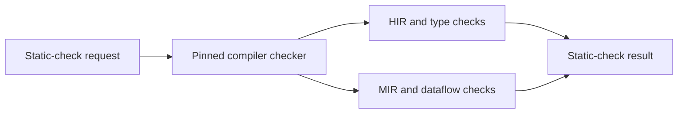

# Requirement Static Checking Design

**Status:** Proposed

This document specifies the static checks that ShallGuard links to individual
requirements. A requirement is a normative statement with a stable ID in a
selected Markdown document. A static check is a deterministic rule that a
program applies to source code. The program does not run the code.
Deterministic means that the same input always gives the same result. This
document is one component of the
[Requirement Assurance Design](requirement-assurance-design.md).

Static checks add to anchors and tests. An anchor is a mark in Rust source code
that links the code to a requirement. A checker is the program code that
performs a static check. Static checks are useful only when a precise machine
rule can express the requirement. A static check does not automatically turn
arbitrary prose into a proof obligation. A proof obligation is a property that
a tool must prove.

## 1. Goals

The static checks have these goals:

- Link static checks that examine syntax or compiler semantics to requirement
  IDs.
- Run static checks selectively for the requirements that a merge request (MR)
  impacts. A merge request is a proposed change that a reviewer examines before
  the merge. An impact is a relationship between a Git change and a
  requirement. Run all static checks in full mode.
- Emit findings in the same format as the other assurance stages. The format is
  versioned, and each finding has a source location.
- Distinguish the syntax, type, control-flow, and formal assurance levels.
- Pin the toolchain and the configuration for static checks that use compiler
  internals. A toolchain is one exact version of the Rust compiler and its
  tools. To pin means to fix one exact version.
- Make the owner, the policy, and the limitations of each checker explicit.
- Make sure that each registered static check references a requirement that
  exists and is active.

## 2. Non-goals

This design does not do these things:

- Generate a sound checker directly from an RFC 2119 sentence. RFC 2119 defines
  the words SHALL, SHALL NOT, and MAY. A sound checker never reports a pass when
  the property does not hold.
- Implement name resolution, type inference, or MIR on top of `syn`. The `syn`
  crate parses Rust source code into a syntax tree. A crate is a Rust package
  of code. MIR is the mid-level intermediate representation of the Rust
  compiler.
- Treat a pattern match on an abstract syntax tree (AST) as proof of runtime
  behavior.
- Replace property tests when inputs and outputs express a behavior naturally.
  A property test runs code with many generated inputs and examines a property
  of the outputs.
- Run third-party checker code inside the core traceability process without an
  explicit trust boundary and version boundary. Traceability is the
  deterministic relationship among requirements, anchors, and evidence.
- Make unstable compiler internals a dependency of the fast path of the check.
  The check is the command `cargo shallguard check`.

## 3. Assurance classes

An assurance class states what kind of evidence a static check gives. HIR is
the high-level intermediate representation of the Rust compiler. A dataflow
analysis follows how values move through a program. The table below lists the
assurance classes:

| Class | Representation | Suitable properties |
|-------|----------------|---------------------|
| Syntax | `syn` AST | Literal defaults, forbidden paths, required arms/attributes |
| Resolved syntax | HIR/types | Resolved calls, trait implementations, concrete types |
| Control flow | MIR/dataflow | Ordering, path dominance, mutation-after-validation |
| Type invariant | Rust API/type design | Invalid states or call sequences are unrepresentable |
| Executable property | Unit/property/model test | Input/output and state-transition invariants |
| Formal contract | Model checker/contract tool | Explicit mathematical property under stated assumptions |

Each result records its assurance class. A report must not describe a syntax
check as a control-flow proof.

## 4. Registration

Each static check has a stable check ID. The check ID is independent from the
requirement ID. Two example check IDs follow:

```text
req-hrs-007-label-free-metric
req-dyn-016-validation-dominates-mutation
```

The initial implementation keeps the registrations in a versioned file in the
workspace. A Cargo workspace is a set of Rust packages that share one build
configuration. Cargo is the build tool for Rust. An example file is
`shallguard/static-checks.toml`:

```toml
schema = 1

[[check]]
id = "req-hrs-007-label-free-metric"
requirements = ["REQ-HRS-007"]
backend = "ast"
implementation = "metric_is_label_free"
policy = "warning"
description = "The split-failure metric has no dynamic label dimensions."

[[check]]
id = "req-dyn-016-validation-dominates-mutation"
requirements = ["REQ-DYN-016"]
backend = "mir"
implementation = "validation_dominates_router_mutation"
policy = "advisory"
toolchain = "workspace"
```

The registry is declarative policy. TOML is a plain-text configuration format.
The implementation name resolves through a closed built-in registry or through
a configured external checker executable. ShallGuard forbids arbitrary commands
from the TOML file.

A backend is the analysis engine that runs a static check. A hard static check
is a static check with the policy `hard`. `shallguard` validates the registry.
It makes sure that:

- each check ID is unique.
- each referenced requirement exists and is not retired.
- the backend value and the policy value are known values.
- the named implementation exists.
- an implementation does not change its assurance class silently.
- each hard static check has an owner and a documented rationale.

A later extension of the document schema can cite the check ID from the
evidence section of a requirement. For the first version, the registration of
the checker is sufficient.

## 5. Common check interface

Each built-in static check implements one common logical interface. The Rust
code below shows the interface:

```rust
trait StaticRequirementCheck {
    fn metadata(&self) -> CheckMetadata;

    fn run(
        &self,
        context: &CheckContext<'_>,
        requirements: &[RequirementId],
    ) -> Result<Vec<StaticFinding>, CheckError>;
}
```

`CheckContext` provides immutable data that ShallGuard computes before the run.
The data is appropriate for the backend. The data includes:

- the requirement graph.
- the head source index. Head is the current revision of the repository.
- the impacted requirements and the changes.
- the Cargo packages, targets, and features. A target is one build output,
  such as a library or a binary. A feature is an optional compile-time switch
  of a package.
- the selected compiler-semantic artifact, when the static check requires it.
  An artifact is a file that a tool writes as its output.
- the normalization of paths relative to the workspace.

A static check returns findings. A static check does not print output. It does
not change source code. It does not call GitLab. It does not make policy
decisions. GitLab is a service that hosts repositories and merge requests.

## 6. Syntax backend

The syntax backend runs in the existing internal Rust tooling. It uses the
`syn` trees that the tooling has already parsed.

A good syntax check is narrow and easy to explain. An enforcement scope is the
code that an enforcement anchor marks. An API is a set of functions that code
calls. Examples of good syntax checks are:

- an exact configuration default.
- the presence of an enum variant or a field.
- the absence of label arguments in one metric registration.
- a required error arm in an anchored match.
- no call to a particular API path within an enforcement scope.
- an expected wrapper type spelling on every field of an anchored type.

The backend can use syntactic module paths. The backend must label unresolved
names as unresolved. For example, the text `record(...)` alone does not show
which `record` function the code calls.

### 6.1 Syntax check example

Take a requirement that says that a metric has no labels. The static check can
do these steps:

1. Resolve the documented enforcement item from the requirement graph.
2. Find the metric registration expression in that item.
3. Confirm that the constructor form declares zero labels.
4. Emit a finding at the label argument if the label argument is not empty.

The limitation of the static check states that an alias or a macro-generated
registration can require the compiler backend. A macro is Rust code that
generates other code at compile time.

## 7. Compiler-semantic backend

Some static checks need name resolution or control-flow information. These
static checks run outside the core checker. They run through a pinned
executable that understands the compiler. The recommended boundary is a
versioned JSON protocol. JSON is a plain-text data format. The boundary is not
an in-process dependency from `shallguard` to `rustc_private`. The
`rustc_private` crates are the internal crates of the Rust compiler.

The diagram below shows the flow of a static-check request:



The request specifies:

- the repository revision.
- the packages, targets, and features.
- the requirement IDs and the check IDs.
- the expected schema version.
- the source digests and the requirement digests. A digest is a short fixed
  value that identifies the content of an input.

The result records:

- the exact Rust toolchain and the checker revision.
- the active `cfg` view. A `cfg` is a Rust compile-time condition.
- the resolved definitions that the checker inspected.
- the findings and the source spans.
- the unsupported constructs or the analysis limits.

A compiler checker runs with no network access. It has no write access to the
workspace, except for the normal compiler outputs.

## 8. Control-flow checks

A control-flow requirement needs a precisely defined event model. A trait is a
Rust interface that types implement. For example, the requirement "validation
happens before router mutation" must define:

- which functions count as validation.
- which calls count as router mutation.
- what represents a successful validation.
- whether error paths, retries, and callbacks are in scope.
- how the analysis handles indirect calls and trait dispatch.
- which Cargo feature configuration the static check examines.

A MIR analysis can prove that a successful validation dominates every mutation
call in the analyzed function graph. Dominates means that every path to the
mutation call passes through the validation first. If unresolved indirect calls
prevent that claim, the result is `inconclusive`. The result is not `passed`.

Where practical, prefer a capability type. A capability type is a type that a
caller can get only after a required step. The code below shows an example:

```rust
fn apply_split(
    evidence: ValidatedEvidence,
    split: SafeSplit,
) -> Result<(), ApplyError>;
```

When the type system enforces the call sequence, a lightweight static check can
make sure that the mutation APIs continue to require the capability type.

## 9. Selecting checks

### 9.1 Full mode

Full mode runs every registered static check against its configured packages
and feature views. Full mode is suitable for a scheduled assurance job. Full
mode is also suitable for static checks that are already hard policy in
continuous integration (CI). CI is the automated pipeline that builds and tests
each change.

### 9.2 MR mode

MR mode runs the static checks that are linked to:

- directly impacted requirements.
- requirements whose text changed.
- changed static-check implementations or registrations.
- high-confidence structural or transitive impacts.
- shared infrastructure areas that policy selects.

When a checker implementation changes, MR mode runs its fixture suite. It also
runs the checker for all requirements registered to it. This happens even if
the application code is unchanged. A fixture is a small test input with a known
expected result.

## 10. Results

The status of a static check is one of these values:

```rust
enum StaticCheckStatus {
    Passed,
    Failed,
    Inconclusive,
    Unsupported,
    InfrastructureError,
    NotSelected,
}
```

`Passed` means that the explicitly defined machine property held in the
recorded analysis configuration. `Passed` does not mean that the analysis
proved the complete natural-language requirement.

Each result contains:

- the requirement IDs and the check ID.
- the assurance class.
- the status.
- the policy.
- the analyzed configuration.
- the inspected symbols.
- the findings and the citations.
- the limitations.
- the implementation digest and the input digests.

## 11. Output schema

The JSON example below shows the output schema:

```json
{
  "schema": "shallguard.requirement-static-check/v1",
  "head_commit": "fedcba9876543210",
  "checks": [
    {
      "id": "req-hrs-007-label-free-metric",
      "requirements": ["REQ-HRS-007"],
      "assurance_class": "syntax",
      "status": "passed",
      "policy": "warning",
      "configuration": {
        "package": "example-app",
        "features": []
      },
      "inspected_symbols": ["metrics::build_metrics_collector"],
      "findings": [],
      "limitations": [
        "macro-generated registrations are not expanded by this backend"
      ]
    }
  ]
}
```

## 12. Policy lifecycle

A new static check starts with the policy `advisory`. The lifecycle has these
steps:

1. Define the machine property and the non-goals.
2. Add positive, negative, ambiguous, and unsupported fixtures.
3. Run the static check in shadow mode against representative history. In
   shadow mode, the results do not block anything.
4. Measure the false positives and the inconclusive results. A false positive
   is a finding where no real violation exists.
5. Promote the static check to `warning` when the findings are useful.
6. Promote the static check to `hard` only with owner approval and stable
   toolchain support.

A change to the property, the backend, or the hard policy of a static check
requires a review. This review is the same as the review for a requirement
change. A hard static check must never silently turn an infrastructure failure
into a success.

## 13. Findings and exit behavior

A static finding has a source location. A static finding contains:

- the check ID and the requirement IDs.
- the severity.
- a concise description of the property.
- the actual observed structure or flow.
- the file and the line.
- the analysis limitations.
- remediation guidance, when the guidance is unambiguous.

The policy controls the exit behavior:

- `advisory`: the static check always exits successfully after it produces an
  artifact.
- `warning`: the findings are visible but do not block.
- `hard`: a `Failed` status blocks CI.
- `Inconclusive` blocks only when the explicit policy of the static check says
  that a complete analysis is required.
- `InfrastructureError` reports a tool failure separately from a property
  failure.

## 14. Caching and reproducibility

A cache key includes:

- the source digests and the requirement digests.
- the digest of the check implementation.
- the backend and the schema version.
- the Rust toolchain.
- the packages, targets, features, and target triple. A target triple names
  the platform that the compiler builds for.
- the active configuration inputs.

ShallGuard must not reuse compiler-semantic results from one feature view for
another feature view. The artifact contains enough provenance to reproduce the
invocation. Provenance is the record of the inputs and tools that produced a
result.

## 15. Testing strategy

Each static check has:

- a positive fixture that passes.
- a negative fixture that produces the intended finding.
- a near-miss fixture that does not cause a false positive.
- an unsupported or ambiguous fixture with the expected status.
- an assertion on the source location.
- a fixture for schema serialization.

Each backend also has integration fixtures for:

- aliases and imports.
- generic calls and trait calls.
- macro invocations.
- `cfg` variants.
- moved or renamed symbols.
- compiler or toolchain upgrades.
- incomplete call graphs.
- a changed check registration.

## 16. Choosing the right mechanism

Before you write a static checker, ask these questions in this order:

1. Can the Rust type system make the invalid state unrepresentable?
2. Is the requirement naturally an executable property over inputs or state?
3. Is a narrow syntax rule sufficient and honest?
4. Does the requirement need resolved HIR or type information?
5. Does the requirement need MIR or control-flow analysis?
6. Is the property important enough to justify a model checker or a formal
   contract? A model checker is a tool that examines all states of a model to
   prove a property.
7. If none of these applies, keep the evidence based on review or tests. Do
   not create a misleading checker.

## 17. Known limitations

- One compiler-semantic run describes one feature and target configuration.
- Rust compiler internals and custom-lint ecosystems need maintenance across
  toolchain upgrades. A lint is a small automated rule that examines code.
- Whole-program call graphs are conservative around dynamic dispatch, FFI, and
  callbacks. A call graph records which functions call which other functions.
  Dynamic dispatch selects the called function at run time. A foreign function
  interface (FFI) calls code in another language.
- An equivalent spelling can bypass a syntax check, unless the design of the
  static check covers all accepted forms.
- A machine property can be correct but narrower than the prose. A report must
  expose that boundary.
- Cross-repository invariants and deployment invariants need separate trusted
  inputs.
