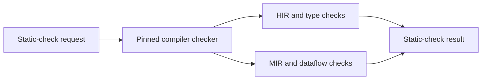

# Requirement Static Checking Design

**Status:** Proposed

This document specifies deterministic static checks associated with individual
requirements. It is a component of
[Requirement Assurance Design](requirement-assurance-design.md).

Static checks supplement anchors and tests. They are useful only when a
requirement can be translated into a precise machine rule; they do not turn
arbitrary prose into a proof obligation automatically.

## 1. Goals

- Associate deterministic syntax or compiler-semantic checks with requirement
  IDs.
- Run checks selectively for requirements impacted by an MR and comprehensively
  in full mode.
- Emit the same locatable, versioned finding format as other assurance stages.
- Distinguish syntax, type, control-flow, and formal assurance levels.
- Pin the toolchain and configuration for compiler-internal checks.
- Make checker ownership, policy, and limitations explicit.
- Cross-check that registered static checks reference defined, active
  requirements.

## 2. Non-goals

- Generating a sound checker directly from an RFC 2119 sentence.
- Implementing name resolution, type inference, or MIR over `syn`.
- Treating an AST pattern match as proof of runtime behavior.
- Replacing property tests when a behavior is naturally expressed through
  inputs and outputs.
- Running third-party checker code inside the core traceability process without
  an explicit trust and version boundary.
- Making unstable compiler internals a dependency of the fast `cargo req-cov check`
  path.

## 3. Assurance classes

| Class | Representation | Suitable properties |
|-------|----------------|---------------------|
| Syntax | `syn` AST | Literal defaults, forbidden paths, required arms/attributes |
| Resolved syntax | HIR/types | Resolved calls, trait implementations, concrete types |
| Control flow | MIR/dataflow | Ordering, path dominance, mutation-after-validation |
| Type invariant | Rust API/type design | Invalid states or call sequences are unrepresentable |
| Executable property | Unit/property/model test | Input/output and state-transition invariants |
| Formal contract | Model checker/contract tool | Explicit mathematical property under stated assumptions |

The result records its assurance class. A syntax check must not be described as
a control-flow proof.

## 4. Registration

Every static check has a stable check ID independent from the requirement ID:

```text
req-hrs-007-label-free-metric
req-dyn-016-validation-dominates-mutation
```

The initial implementation keeps registrations in a versioned workspace file,
for example `req-trace/static-checks.toml`:

```toml
schema = 1

[[check]]
id = "req-hrs-007-label-free-metric"
requirements = ["REQ-HRS-007"]
backend = "ast"
implementation = "metric_is_label_free"
policy = "warning"
description = "The split-failure metric has no dynamic label dimensions."

[[check]]
id = "req-dyn-016-validation-dominates-mutation"
requirements = ["REQ-DYN-016"]
backend = "mir"
implementation = "validation_dominates_router_mutation"
policy = "advisory"
toolchain = "workspace"
```

The registry is declarative policy. The implementation name resolves through a
closed built-in registry or a configured external checker executable; arbitrary
commands from the TOML file are forbidden.

`req-trace` validates that:

- IDs are unique;
- referenced requirements exist and are not retired;
- backend and policy values are recognized;
- the named implementation exists;
- one implementation does not silently change assurance class;
- hard checks have an owner and a documented rationale.

A later document-schema extension may cite the check ID from a requirement's
evidence section, but checker registration is sufficient for the first version.

## 5. Common check interface

Built-in checks implement a common logical interface:

```rust
trait StaticRequirementCheck {
    fn metadata(&self) -> CheckMetadata;

    fn run(
        &self,
        context: &CheckContext<'_>,
        requirements: &[RequirementId],
    ) -> Result<Vec<StaticFinding>, CheckError>;
}
```

`CheckContext` provides immutable, precomputed data appropriate to the backend:

- requirement graph;
- head source index;
- impacted requirements and changes;
- Cargo packages, targets, and features;
- selected compiler-semantic artifact when required;
- workspace-relative path normalization.

Checks return findings. They do not print, mutate source, invoke GitLab, or make
policy decisions.

## 6. Syntax backend

The syntax backend runs in the existing internal Rust tooling and uses the
already parsed `syn` trees.

Good syntax checks are narrow and explainable:

- exact configuration default;
- enum variant or field presence;
- absence of label arguments in one metric registration;
- an anchored match contains a required error arm;
- a particular API path is not called within an enforcement scope;
- every field in an anchored type carries an expected wrapper type spelling.

The backend may use syntactic module paths but must label unresolved names as
such. For example, seeing `record(...)` is not enough to know which `record`
function is called.

### 6.1 Syntax check example

For a requirement that a metric be label-free, the check can:

1. Resolve the documented enforcement item from the requirement graph.
2. Find the metric registration expression in that item.
3. Confirm that its constructor form declares zero labels.
4. Emit a finding at the label argument if non-empty.

The check's limitation states that aliasing or macro-generated registration may
require the compiler backend.

## 7. Compiler-semantic backend

Checks needing resolution or control flow run outside the core checker through
a pinned compiler-aware executable. The recommended boundary is a versioned
JSON protocol, not an in-process dependency from `req-trace` to `rustc_private`.



The request specifies:

- repository revision;
- packages, targets, and features;
- requirement and check IDs;
- expected schema version;
- source and requirement digests.

The result records:

- exact Rust toolchain and checker revision;
- active `cfg` view;
- resolved definitions inspected;
- findings and source spans;
- unsupported constructs or analysis limits.

Compiler checkers run with no network or workspace-write access beyond normal
compiler outputs.

## 8. Control-flow checks

Control-flow requirements need a precisely defined event model. For example,
"validation happens before router mutation" must define:

- which functions count as validation;
- which calls count as router mutation;
- what represents successful validation;
- whether error paths, retries, and callbacks are in scope;
- how indirect calls and trait dispatch are handled;
- which Cargo feature configuration is checked.

A MIR analysis might prove that successful validation dominates every mutation
call in the analyzed function graph. If unresolved indirect calls prevent that
claim, the result is `inconclusive`, not `passed`.

Static checks should prefer capability types where practical:

```rust
fn apply_split(
    evidence: ValidatedEvidence,
    split: SafeSplit,
) -> Result<(), ApplyError>;
```

When the type system enforces the call sequence, a lightweight static check can
ensure mutation APIs continue to require the capability type.

## 9. Selecting checks

### 9.1 Full mode

Run every registered check against its configured packages and feature views.
This is suitable for a scheduled assurance job or for checks already adopted as
hard CI policy.

### 9.2 MR mode

Run checks associated with:

- directly impacted requirements;
- changed requirement specifications;
- changed static-check implementations or registrations;
- high-confidence structural/transitive impacts;
- shared infrastructure areas selected by policy.

A changed checker implementation runs its fixture suite and all requirements
registered to it even if application code is unchanged.

## 10. Results

```rust
enum StaticCheckStatus {
    Passed,
    Failed,
    Inconclusive,
    Unsupported,
    InfrastructureError,
    NotSelected,
}
```

`Passed` means the explicitly defined machine property held in the recorded
analysis configuration. It does not imply that the complete natural-language
requirement was proven.

Each result contains:

- requirement and check IDs;
- assurance class;
- status;
- policy;
- analyzed configuration;
- inspected symbols;
- findings and citations;
- limitations;
- implementation and input digests.

## 11. Output schema

```json
{
  "schema": "shallguard.requirement-static-check/v1",
  "head_commit": "fedcba9876543210",
  "checks": [
    {
      "id": "req-hrs-007-label-free-metric",
      "requirements": ["REQ-HRS-007"],
      "assurance_class": "syntax",
      "status": "passed",
      "policy": "warning",
      "configuration": {
        "package": "example-app",
        "features": []
      },
      "inspected_symbols": ["metrics::build_metrics_collector"],
      "findings": [],
      "limitations": [
        "macro-generated registrations are not expanded by this backend"
      ]
    }
  ]
}
```

## 12. Policy lifecycle

New static checks begin as `advisory`:

1. Define the machine property and non-goals.
2. Add positive, negative, ambiguous, and unsupported fixtures.
3. Run in shadow mode against representative history.
4. Measure false positives and inconclusive results.
5. Promote to `warning` when findings are useful.
6. Promote to `hard` only with owner approval and stable toolchain support.

Changing a check's property, backend, or hard policy requires review like a
requirement change. A hard check must never silently turn infrastructure failure
into success.

## 13. Findings and exit behavior

A static finding is locatable and contains:

- check and requirement IDs;
- severity;
- concise property description;
- actual observed structure/flow;
- file and line;
- analysis limitations;
- remediation guidance when unambiguous.

Exit behavior is policy-driven:

- `advisory`: always exits successfully after producing an artifact;
- `warning`: visible but non-blocking;
- `hard`: a `Failed` status blocks CI;
- `Inconclusive` blocks only when the check's explicit policy says complete
  analysis is required;
- `InfrastructureError` reports tool failure separately from property failure.

## 14. Caching and reproducibility

Cache keys include:

- source and requirement digests;
- check implementation digest;
- backend and schema version;
- Rust toolchain;
- packages, targets, features, and target triple;
- active configuration inputs.

Compiler-semantic results from one feature view must not be reused for another.
The artifact contains enough provenance to reproduce the invocation.

## 15. Testing strategy

Every check has:

- positive fixture that passes;
- negative fixture producing the intended finding;
- near-miss fixture avoiding a false positive;
- unsupported/ambiguous fixture with the expected status;
- source-location assertion;
- schema serialization fixture.

Backends additionally have integration fixtures for:

- aliases and imports;
- generic and trait calls;
- macro invocations;
- `cfg` variants;
- moved/renamed symbols;
- compiler/toolchain upgrades;
- incomplete call graphs;
- changed check registration.

## 16. Choosing the right mechanism

Before writing a static checker, use this order:

1. Can Rust's type system make the invalid state unrepresentable?
2. Is the requirement naturally an executable property over inputs/state?
3. Is a narrow syntax rule sufficient and honest?
4. Does it require resolved HIR/type information?
5. Does it require MIR/control-flow analysis?
6. Is the property important enough to justify model checking or a contract?
7. If none applies, keep the evidence as review/test based rather than create a
   misleading checker.

## 17. Known limitations

- One compiler-semantic run describes one feature/target configuration.
- Rust compiler internals and custom-lint ecosystems require maintenance across
  toolchain upgrades.
- Whole-program call graphs are conservative around dynamic dispatch, FFI, and
  callbacks.
- Syntax checks can be bypassed by equivalent spelling unless deliberately
  designed around all accepted forms.
- A machine property can be correct but narrower than the prose; reports must
  expose that boundary.
- Cross-repository and deployment invariants need separate trusted inputs.
